```plantuml
@startuml
...
@enduml
```

# 0002. PlantUML source collapses into `<details>`, not an HTML comment

## Context

Every PlantUML diagram in a markdown file is stored twice: as source in a fenced ```` ```plantuml ```` block, and as an image link to the server that renders it. Both were visible, so a reader met the source before the picture, and a long diagram pushed its own image off the first screen. [Issue #414](https://github.com/artem-from-ua/claude-plugins/issues/414) asked for the source to stay in the file but stop rendering.

The obvious way to do that is an HTML comment, and that is what the issue proposed:

```
<!-- plantuml
@startuml
...
@enduml
-->
```

Two constraints decide against it, and neither is a matter of taste.

**HTML comments have no escaping mechanism.** The WHATWG standard ends a comment at the first `-->`, unconditionally; there is no character sequence that represents a literal `-->` inside one. And `-->` is not an edge case in PlantUML — it is the response arrow in a sequence diagram, the transition in a state diagram, the relation in class and activity diagrams. Five of this plugin's own seventeen fences contain one. Rendered through GitHub's Markdown API, a diagram wrapped this way spills the tail of its source onto the page: the reader sees `tr --> cl`, `cl --> ar`, the whole legend block, and `**Box fill**` interpreted as bold text. The feature meant to remove clutter produces more of it than the visible fence did.

**The fence is how diagrams are found.** `/plantuml-validate` locates work with `grep -rl '```plantuml'`. A comment form removes the fence, so hidden diagrams would silently drop out of validation.

A third constraint shaped the surrounding design rather than the format. The PostToolUse hook runs `--sync` after every `.md` write, and the plugin is often installed globally, so whatever this decision produces is applied automatically across every repository the user opens.

## Decision

A diagram's source is wrapped in `<details>` around the ordinary fence:

````
<details>
<summary>Diagram source</summary>
<!-- plantuml-generated -->



</details>


````

The source stays in a fenced code block. That is the whole trick: fence content is code text, so the renderer escapes a literal `-->` or `</details>` in a diagram label instead of acting on it. Verified against GitHub's Markdown API with both strings in one diagram — they come back as `--&gt;` and `&lt;/details&gt;` inside `<pre>`, the collapsible closes at its own tag, and the image survives.

Consequences of keeping the fence: `grep` discovery is unchanged, syntax highlighting is preserved, the source is plain text in a diff, and it is one click from the rendered page.

Supporting choices:

- **Collapsed is the only stored form**, with no project-level setting. Two forms would double the parser's state space to spare one line of rendered output.
- **Exactly one image link, after `</details>`.** A second link inside the wrapper renders the diagram twice.
- **A blank line after `</summary>` is required** — without it GitHub renders the backticks literally instead of a highlighted block.
- **Opting out never touches the source.** A `<!-- plantuml-source: visible -->` line keeps a document visible; the same comment before a fence, or `visible` in the fence info string, keeps one diagram. Because the marker is outside the source, no URL is re-encoded — the four documents in this repository that need visible sources kept every URL they had.
- **The wrapper carries `<!-- plantuml-generated -->`.** Without a sentinel the tool cannot tell its own wrapper from a `<details>` the author wrote, and would overwrite their `<summary>` text.
- **Two shapes are reported, never rewritten:** a half-written wrapper, and a fence indented in a list or inside a blockquote. Both are ambiguous, and guessing corrupts.
- **The hook's scope is narrowed** to files under version control and outside vendored or generated trees.

## Alternatives considered

**HTML comment (`<!-- plantuml ... -->`), as issue #414 proposed.** Rejected: breaks on `-->`, which 29% of this repository's diagrams contain, and hides the fence from `grep` discovery. Both verified rather than reasoned about — the first against GitHub's Markdown API, the second by reading the validate command.

**HTML comment only for diagrams whose body has no `-->`.** Rejected: a format whose validity depends on the diagram's content is a trap. Adding one response arrow later silently breaks the document, and `--sync` cannot repair it without changing the format underneath the author.

**A sidecar `.puml` file with a reference in the markdown.** Rejected: splits a diagram from the document that explains it, breaks single-file portability, and gives the sync hook two files to keep in step instead of one.

**Image first, source below.** Rejected: requires inverting the parser — the image would have to be matched before the fence — for no difference in what a reader sees, since the source is collapsed either way.

**An invisible `<summary>` via `style`, `class` or `hidden`.** Impossible, not merely rejected: GitHub's sanitizer strips all three attributes, confirmed by reading its allow-list. One visible line per diagram is the floor, so the design makes that line useful instead of pretending it away.

**A project-level `source_visibility` setting.** Rejected: the plugin has no config file today, and adding one buys a choice between two forms that both work. The per-document marker covers the real need — documents that teach PlantUML — at no configuration cost.

**A marker inside the diagram source (`' plantuml-source: visible`).** Rejected as the primary mechanism, though `'` comments do work in every diagram type tested. It is in the wrong layer: it changes the source, so every opted-out diagram re-encodes its URL; it cannot express "leave this whole document alone"; and it puts tool bookkeeping inside examples whose purpose is to be exemplary.

**Keeping the source visible by default, collapsing on request.** Rejected: it makes the feature something a user must find and enable per diagram, which is most of the way to not shipping it. The cost of the opposite default is a MAJOR version and a migration users can review with `--dry-run`.

## Consequences

**Positive.** Works for every diagram, with no escaping anywhere. Discovery, linting and URL verification needed no changes. Reviewers see the source in the diff and one click away in the rendered page. The refactor that made it possible — one extractor and one emitter replacing three near-duplicate regexes — fixed three pre-existing corruptions: a diagram whose note contains triple backticks was truncated and had its image link spliced into the source; an indented or blockquoted fence gained a duplicate image while `--check` reported everything in sync; and a fence quoted inside another fence or a heredoc was rewritten as if it were a real diagram. The idiom also ports: a future mermaid plugin has no image link at all and therefore no comment-based option, but `<details>` around the fence works there identically.

**Negative.** One visible `Diagram source` line per diagram, permanently — GitHub allows no way to hide it. Two on-disk forms to support forever, since visible documents remain legitimate. `<details>` is HTML-in-Markdown: renderers with raw HTML disabled degrade to showing the source, which is the old behavior rather than a break, but it is not universal. And the release changes what `--check` accepts, so a document that committed cleanly yesterday — a diagram indented inside a list, say — can now block a commit until its author moves it.
