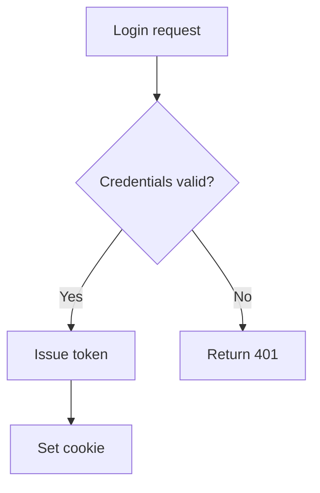
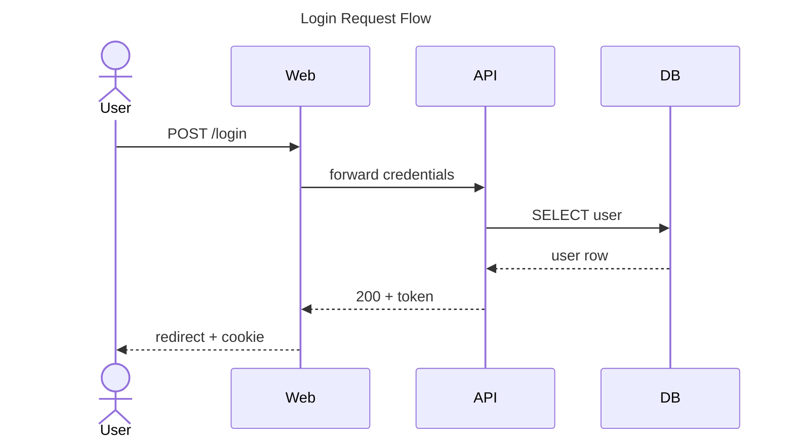
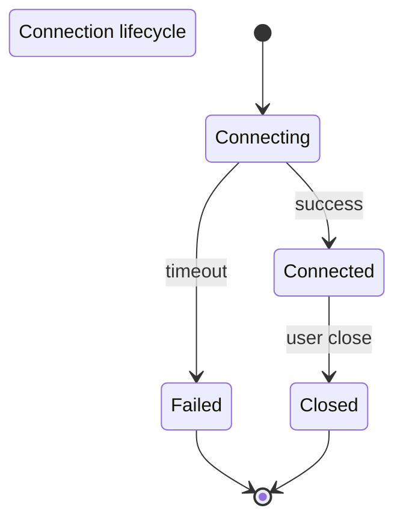
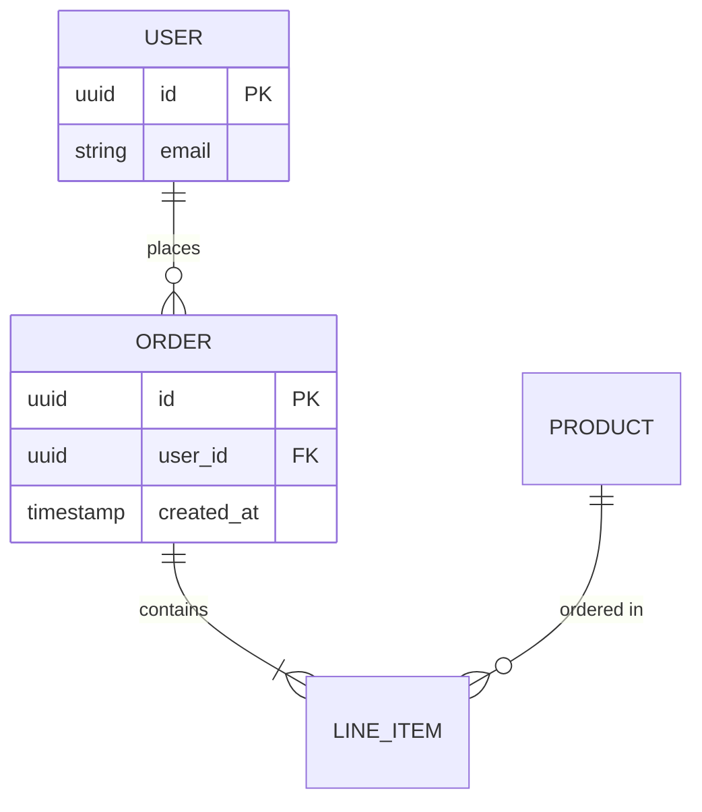
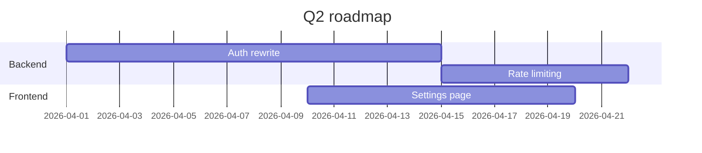
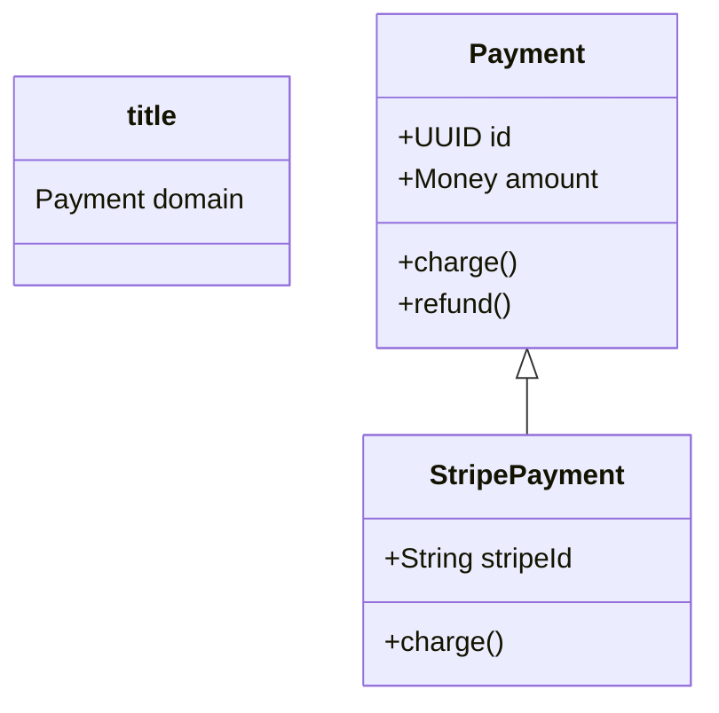

# Mermaid Diagram Type Guide

Use this guide to choose the right Mermaid diagram type for documentation. When creating or updating `.md` files, proactively suggest and use the appropriate diagram type.

**IMPORTANT:** Every diagram MUST include a title where the syntax supports it:
- `sequenceDiagram` / `classDiagram` / `stateDiagram-v2` / `erDiagram`: use `title: ...` frontmatter block (see syntax column)
- `gantt`: `title ...` directive
- `flowchart`: prepend a `%% Title: ...` comment on line 1

## Mermaid vs PlantUML — which to pick

- **Mermaid** (this plugin): GitHub/Obsidian/VS Code docs, simple flowcharts, quick sequences, lightweight ERD, project gantts. Renders natively — no image URL needed.
- **PlantUML** (separate plugin): complex UML (timing, deployment, nwdiag, wireframes/Salt), nested components, fine-grained styling, in-terminal ASCII rendering.
- When in doubt for simple docs → Mermaid. When you need UML rigor → PlantUML.

## Diagram Types (v0.1.0)

| Type | When to use | When to suggest | Syntax |
|------|-------------|-----------------|--------|
| **Flowchart** | Decision trees, branching logic, algorithm flow, CI/CD pipelines, process flow | Any "how does this work step by step" doc; decision logs; script/pipeline flow | `flowchart TD` / `LR` with `A --> B`, `A -->|label| B`, `{Decision}`, `[[Subroutine]]` |
| **Sequence** | Interactions between services, API request/response, message passing, auth flows | Spec files describing inter-service communication; new API endpoints; event flows | `sequenceDiagram` with `A->>B: msg`, `B-->>A: reply`, `activate`/`deactivate`, `alt`/`loop` |
| **State** | State machines, object lifecycles, session/connection states, workflow statuses | Code with state transitions; specs describing distinct behavioral states; workflow engines | `stateDiagram-v2` with `[*] --> Active`, `Active --> Idle`, nested states |
| **Class** | Class hierarchies, interfaces, data models (Pydantic/dataclasses), entity structure | Adding new model classes; refactoring hierarchies; storage/query object docs | `classDiagram` with `class Name { +field: Type; +method() }`, `A <|-- B`, `A --> B` |
| **ER** | Database schemas, table relationships with cardinality (1:1, 1:N, M:N) | Any database storage design; schema docs; migration planning | `erDiagram` with `USER \|\|--o{ ORDER : places`, attribute blocks |
| **Gantt** | Project timelines, phase planning, task dependencies, milestones | Roadmap docs; sprint/phase planning; release schedules | `gantt` with `title ...`, `dateFormat YYYY-MM-DD`, `section`, `task :id, YYYY-MM-DD, Nd` |

## Quick Selection Guide

- **"Who sends what to whom?"** → Sequence
- **"What's the algorithm/decision flow?"** → Flowchart
- **"What states can this be in?"** → State
- **"What do the classes look like?"** → Class
- **"What's in the database?"** → ER
- **"What's the project timeline?"** → Gantt

## Required Conventions

1. **Title first.** Every diagram must have a title. Self-documenting diagrams only.
2. **No image link.** Unlike PlantUML, Mermaid renders natively in GitHub/Obsidian/IDE. Do NOT add an image URL after the code block.
3. **Fenced block.** Always ` ```mermaid `, never bare ` ``` ` or alternative fences.
4. **Keep it simple.** If the diagram needs > 20 nodes or heavy styling, consider splitting it or switching to PlantUML.

## Quick Examples

### Flowchart


### Sequence


### State


### ER


### Gantt


### Class

