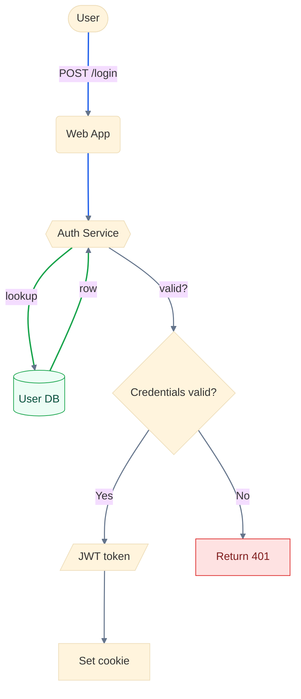
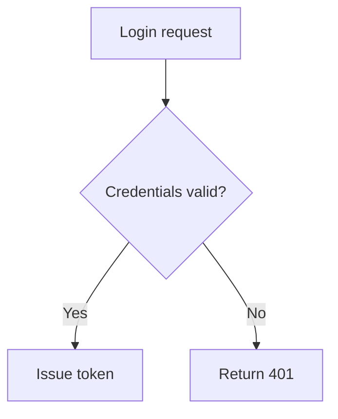
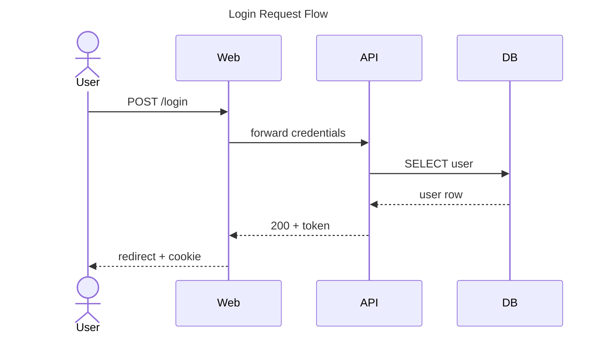
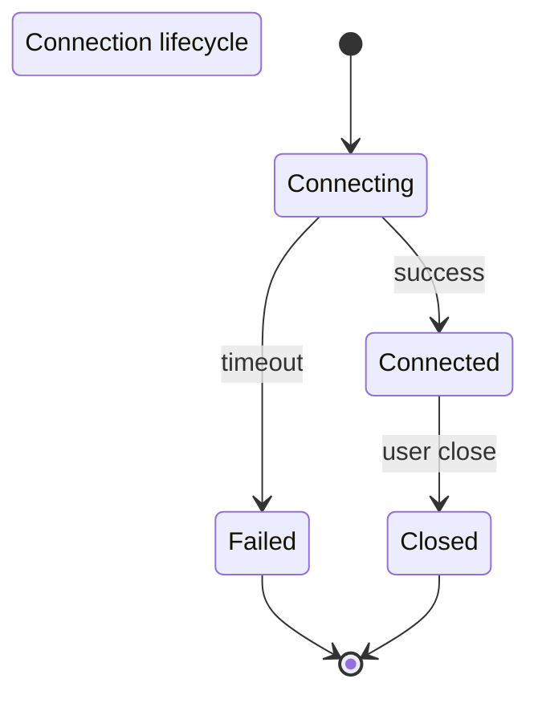
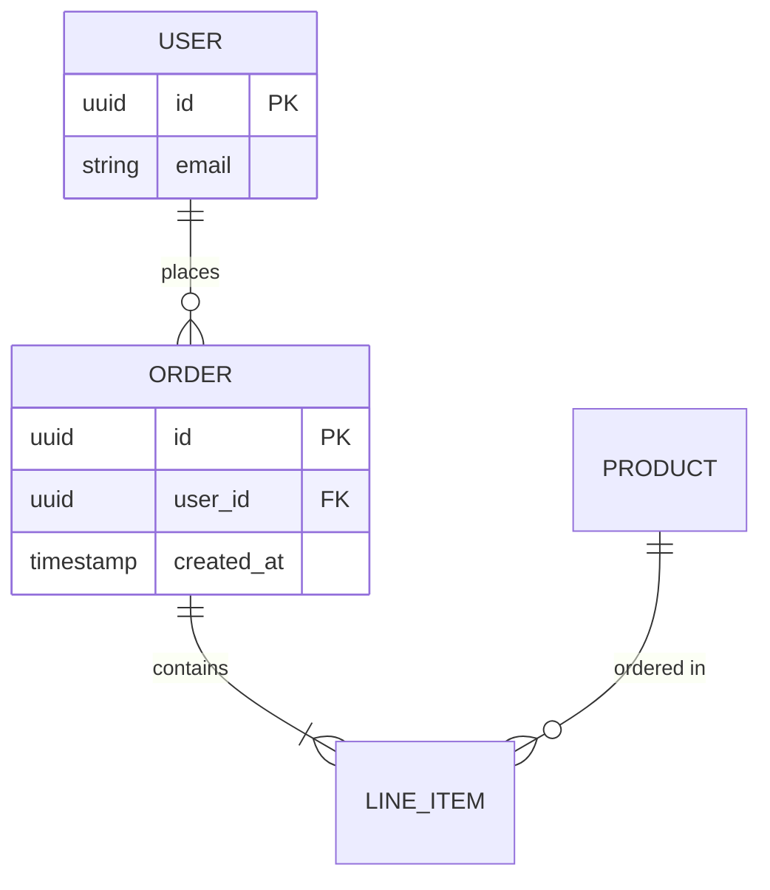
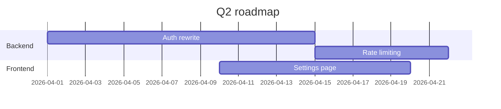
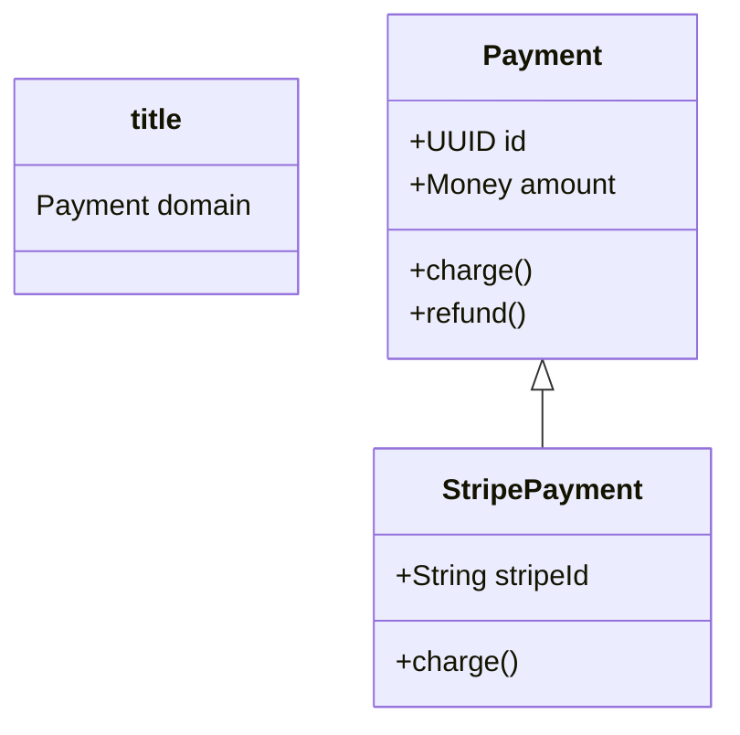

# Mermaid Diagram Type Guide

Use this guide to choose the right Mermaid diagram type for documentation. When creating or updating `.md` files, proactively suggest and use the appropriate diagram type.

**IMPORTANT:** Every diagram MUST include a title where the syntax supports it:
- `sequenceDiagram` / `classDiagram` / `stateDiagram-v2` / `erDiagram`: use `title: ...` frontmatter block (see syntax column)
- `gantt`: `title ...` directive
- `flowchart`: prepend a `%% Title: ...` comment on line 1

## Mermaid vs PlantUML — which to pick

- **Mermaid** (this plugin): GitHub/Obsidian/VS Code docs, simple flowcharts, quick sequences, lightweight ERD, project gantts. Renders natively — no image URL needed.
- **PlantUML** (separate plugin): complex UML (timing, deployment, nwdiag, wireframes/Salt), nested components, fine-grained styling, in-terminal ASCII rendering.
- When in doubt for simple docs → Mermaid. When you need UML rigor → PlantUML.

## Diagram Types

| Type | When to use | When to suggest | Syntax |
|------|-------------|-----------------|--------|
| **Flowchart** | Decision trees, branching logic, algorithm flow, CI/CD pipelines, process flow | Any "how does this work step by step" doc; decision logs; script/pipeline flow | `flowchart TD` / `LR` with `A --> B`, `A -->|label| B`, `{Decision}`, `[[Subroutine]]` |
| **Sequence** | Interactions between services, API request/response, message passing, auth flows | Spec files describing inter-service communication; new API endpoints; event flows | `sequenceDiagram` with `A->>B: msg`, `B-->>A: reply`, `activate`/`deactivate`, `alt`/`loop` |
| **State** | State machines, object lifecycles, session/connection states, workflow statuses | Code with state transitions; specs describing distinct behavioral states; workflow engines | `stateDiagram-v2` with `[*] --> Active`, `Active --> Idle`, nested states |
| **Class** | Class hierarchies, interfaces, data models (Pydantic/dataclasses), entity structure | Adding new model classes; refactoring hierarchies; storage/query object docs | `classDiagram` with `class Name { +field: Type; +method() }`, `A <|-- B`, `A --> B` |
| **ER** | Database schemas, table relationships with cardinality (1:1, 1:N, M:N) | Any database storage design; schema docs; migration planning | `erDiagram` with `USER \|\|--o{ ORDER : places`, attribute blocks |
| **Gantt** | Project timelines, phase planning, task dependencies, milestones | Roadmap docs; sprint/phase planning; release schedules | `gantt` with `title ...`, `dateFormat YYYY-MM-DD`, `section`, `task :id, YYYY-MM-DD, Nd` |

## Quick Selection Guide

- **"Who sends what to whom?"** → Sequence
- **"What's the algorithm/decision flow?"** → Flowchart
- **"What states can this be in?"** → State
- **"What do the classes look like?"** → Class
- **"What's in the database?"** → ER
- **"What's the project timeline?"** → Gantt

## Required Conventions

1. **Title first.** Every diagram must have a title. Self-documenting diagrams only.
2. **No image link.** Unlike PlantUML, Mermaid renders natively in GitHub/Obsidian/IDE. Do NOT add an image URL after the code block.
3. **Fenced block.** Always ` ```mermaid `, never bare ` ``` ` or alternative fences.
4. **Keep it simple.** If the diagram needs > 20 nodes or heavy styling, consider splitting it or switching to PlantUML.
5. **Accessibility.** Add `accTitle: ...` and `accDescr: ...` directives for every diagram that supports them (flowchart, sequence, class, state, ER) — screen readers use these.

## Styling & Semantics

A monochrome, rectangle-only diagram is usually worse than no diagram. Use shapes and colors *semantically* — meaning that an informed reader can infer a node's role from its appearance.

### Shape vocabulary (flowchart)

| Shape | Syntax | Meaning |
|-------|--------|---------|
| Rectangle | `A[Name]` | Default — generic step or component |
| Rounded | `A(Name)` | Process or action |
| Stadium | `A([Name])` | Actor or external user |
| Cylinder | `A[(Name)]` | Persistent storage (DB, file store, cache) |
| Hexagon | `A{{Name}}` | Orchestrator, router, decision coordinator |
| Rhombus | `A{Name?}` | Decision / conditional branch |
| Subroutine | `A[[Name]]` | Call into another flow/module |
| Parallelogram | `A[/Name/]` | Input or output artifact |
| Trapezoid | `A[\Name\]` | Manual/human step |

### Link semantics (flowchart)

Apply `linkStyle` to convey intent. Index `linkStyle` entries are zero-based in order of appearance.

| Color | Use for |
|-------|---------|
| Blue `#2563eb` | Primary data flow (request, payload, event stream) |
| Orange `#ea580c` | Control / command (trigger, invocation, signal) |
| Green `#16a34a` | Storage read/write (persistence ops) |
| Purple `#9333ea` | Feedback / loop-back (retry, backpressure, callback) |
| Gray dashed | Optional, async, or error path |

Use `linkStyle default stroke:#64748b,stroke-width:1.5px` as a baseline, then override specific edges.

### Node classes (`classDef`)

Define named classes once, apply to any set of nodes. Use these four defaults unless the diagram needs more:

```
classDef storage fill:#ecfdf5,stroke:#16a34a,color:#064e3b;
classDef external fill:#fef3c7,stroke:#d97706,color:#78350f;
classDef critical fill:#fee2e2,stroke:#dc2626,color:#7f1d1d;
classDef deprecated fill:#f1f5f9,stroke:#94a3b8,color:#475569,stroke-dasharray: 5 5;
class DB,Cache storage;
class StripeAPI external;
class AuthGate critical;
class LegacyCron deprecated;
```

### Layout and spacing

Prepend an `%%{init}%%` block to control layout without hand-tuning. Use these defaults for anything over ~8 nodes:

```
%%{init: {'theme':'base','flowchart':{'curve':'basis','nodeSpacing':70,'rankSpacing':100,'htmlLabels':true}}}%%
```

- `curve: 'basis'` — smooth orthogonal routing (alternatives: `'linear'`, `'step'`)
- `nodeSpacing` / `rankSpacing` — horizontal/vertical breathing room
- `htmlLabels: true` — enables `<br/>` in labels for multi-line text

### Interactivity (when relevant)

Mermaid supports `click` handlers — useful in docs where a node maps to a source file or external resource:

```
click AuthService "https://github.com/acme/repo/blob/main/auth/service.py" "Auth service source"
```

Don't overdo it — every `click` adds noise. Use only when the link is genuinely the reader's next question.

## Quick Examples

### Flowchart (with full styling)

A production-quality flowchart uses shapes, link semantics, `classDef`, `accTitle`, and `%%{init}%%` together. This example shows the full pattern — adapt, don't copy verbatim.



### Flowchart (minimal)

For a quick decision in a README, skip the theming:



### Sequence


### State


### ER


### Gantt


### Class

