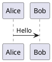

# PlantUML Plugin

PlantUML diagram automation for Claude Code: auto-sync markdown URLs, ASCII rendering in terminal, validation, and diagram type guide.

## Features

### 1. Markdown Diagram Sync (PostToolUse)
- Automatically updates PlantUML image URLs in markdown files after edits
- Ensures URLs always match source code blocks
- No manual encoding needed

### 2. ASCII Terminal Rendering (SessionStart + PreToolUse)
- Renders diagrams as ASCII art for terminal explanations
- **Zero permission prompts** — PreToolUse hooks auto-allow all operations
- **Full diagram display** — WebFetch approach prevents UI collapse
- Workflow: encode source → WebFetch from plantuml.com/txt/{encoded} → display

### 3. Diagram Type Guide (Skill)
- Automatically invoked before creating PlantUML diagrams
- Covers 17 diagram types with selection guidance
- Ensures correct diagram type for each use case

### 4. Validation (Command)
- `/plantuml-validate` command checks all diagrams in markdown files
- CI/CD integration via `--check` flag
- Git pre-commit hooks prevent stale URLs

## Installation

This plugin is available in the **Tribe Coding** marketplace.

1. Add marketplace to Claude Code:
   ```bash
   claude marketplace add tribe-coding https://github.com/Tribe-Coding/claude-plugins.git
   ```

2. Install plugin:
   ```bash
   claude plugin install plantuml@tribe-coding
   ```

3. (Optional) Install marketplace sync for auto-updates:
   ```bash
   bash <(curl -fsSL https://raw.githubusercontent.com/Tribe-Coding/claude-plugins/main/scripts/install-sync.sh)
   ```

## Usage

### Markdown Documentation
When creating `.md` files, Claude will automatically:
1. Invoke diagram type guide skill
2. Create PlantUML diagrams with two-part format:
   - Code block with `plantuml` language tag
   - Image link to rendered SVG
3. Auto-update URLs when source changes

Example:
```markdown



```

### Terminal Explanations
When explaining architecture or flows, Claude will:
1. Encode diagram source
2. Fetch ASCII from PlantUML API
3. Display full diagram without prompts or UI collapse

No user action needed — fully automatic.

### Validation
Check all diagrams in project:
```bash
/plantuml-validate
```

## How It Works

### SessionStart Hooks
1. **inject-base-rules.sh** — Outputs formatting rules and ASCII rendering workflow
2. **setup-project.sh** — Installs git pre-commit hooks

### PostToolUse Hooks
- **sync-plantuml.sh** — Runs after Write/Edit on `.md` files, updates diagram URLs

### PreToolUse Hooks
- **allow-rendering.sh** — Auto-allows PlantUML operations without prompts:
  - Encoding commands (`plantuml-encode.py`)
  - Temp file operations (`/tmp/*.puml` via Bash or Write tool)
  - Cleanup commands (`rm /tmp/*.puml`)

### Skills
- **plantuml-diagram-guide** — Invoked automatically before diagram creation

### Commands
- **plantuml-validate** — Manual validation and CI/CD checks

## Technical Details

### ASCII Rendering Architecture (v1.5.6+)

**Problem:** Claude Code UI collapses Bash tool results >40-50 lines.

**Solution:** Use WebFetch instead of Bash commands.
- WebFetch results are NOT collapsed by UI
- Versions 1.4.0-1.5.5 used Bash (regression)
- Version 1.5.6+ reverted to WebFetch (original working approach)

**Workflow:**
1. Claude encodes PlantUML source via `plantuml-encode.py`
2. WebFetch ASCII from `https://www.plantuml.com/plantuml/txt/{encoded}`
3. Full diagram displayed in terminal

**PreToolUse Hook Patterns:**
```bash
# Auto-allow encoding
plantuml-encode.py

# Auto-allow temp file creation
cat > /tmp/*.puml

# Auto-allow cleanup
rm /tmp/*.puml

# Auto-allow Write tool
/tmp/*.puml
```

**Security:** All patterns restricted to `/tmp` directory and `.puml` extension.

### SessionStart Path Resolution

**Problem:** `${CLAUDE_PLUGIN_ROOT}` doesn't resolve in heredoc output.

**Solution:** Dynamic resolution in script:
```bash
PLUGIN_ROOT="${CLAUDE_PLUGIN_ROOT:-$(cd "$(dirname "$0")/.." && pwd)}"
```

Outputs absolute paths like:
```
/Users/user/.claude/plugins/cache/tribe-coding/plantuml/1.5.8/scripts/plantuml-encode.py
```

**Key insight:** `${CLAUDE_PLUGIN_ROOT}` only works in hooks.json `command` fields, NOT in text output.

## Configuration

No configuration needed — works out of the box.

Optional git pre-commit hook installed automatically via SessionStart hook.

## Troubleshooting

### Permission prompts still appearing
- Ensure version 1.5.8+: `cat ~/.claude/plugins/installed_plugins.json | jq '.plugins["plantuml@tribe-coding"]'`
- Restart Claude Code session to reload hooks
- Check PreToolUse hook is active: operations should execute without prompts

### ASCII diagrams collapsed in UI
- Ensure version 1.5.6+: WebFetch approach prevents collapse
- If using older version, upgrade: `claude plugin update plantuml@tribe-coding`

### URLs not syncing
- PostToolUse hook runs automatically on Write/Edit
- Manual sync: edit any line in `.md` file and save
- Check hook output for errors in Claude Code console

## Contributing

See [ACCEPTANCE_TESTS.md](docs/ACCEPTANCE_TESTS.md) for comprehensive test documentation.

## Changelog

See [CHANGELOG.md](CHANGELOG.md) for version history.

## License

MIT
