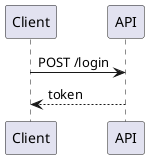

# PlantUML

> [!TIP]
> ✨ ***Add diagrams to your docs and conversations — Claude picks the type, draws, and keeps them in sync.***

With this plugin, Claude proactively illustrates architecture, flows, and data structures using [PlantUML](https://plantuml.com): in markdown documentation and directly in the terminal during conversations.

> [!NOTE]
> [⚙️ How it works](#how-it-works) · [📦 Installation](#installation) · [🗑️ Uninstall](#uninstall) · [📚 Reference](#reference)

## 🎬 Demo <a name="demo"></a>

A developer asks Claude to document the login flow. Claude adds a diagram to the docs — then, during the conversation, renders the same diagram as ASCII art in the terminal.

### Step 1 — Claude writes `docs/auth.md` and adds a diagram proactively

```markdown
> Document the login flow for the auth service.

✦ Using skill: plantuml-diagram-guide

I'll create docs/auth.md. The flow involves four actors — I'll use a sequence diagram.

● Write(docs/auth.md)
  ┌───────────────────────────────────────────────────────────────────┐
  │ # Auth Service                                                    │
  │                                                                   │
  │ ## Login Request Flow                                             │
  │                                                                   │
  │ ```plantuml                                                       │
  │ @startuml                                                         │
  │ title Login Request Flow                                          │
  │                                                                   │
  │ actor User                                                        │
  │ participant "Web App" as Web                                      │
  │ participant "Auth API" as API                                     │
  │ database "PostgreSQL" as DB                                       │
  │                                                                   │
  │ User -> Web : POST /login                                         │
  │ Web -> API : forward credentials                                  │
  │ API -> DB : SELECT user WHERE email = ?                           │
  │ DB --> API : user row                                             │
  │ API --> Web : 200 OK + token                                      │
  │ Web --> User : redirect + set cookie                              │
  │ @enduml                                                           │
  │ ```                                                               │
  │                                                                   │
  │    │
  └───────────────────────────────────────────────────────────────────┘

⏺ Done — docs/auth.md created. The image URL stays in sync automatically whenever you edit the source block.
```


### Step 2 — Later in the conversation, Claude renders it as ASCII in the terminal

```markdown
> Walk me through the login flow step by step.

✦ Using skill: plantuml-diagram-guide

Here's the full flow:

                                     Login Request Flow

       ┌─┐                                                                    ,.-^^-._
       ║"│                                                                   |-.____.-|
       └┬┘                                                                   |        |
       ┌┼┐                                                                   |        |
        │                  ┌───────┐           ┌────────┐                    |        |
       ┌┴┐                 │Web App│           │Auth API│                    '-.____.-'
      User                 └───┬───┘           └────┬───┘                   PostgreSQL
        │     POST /login      │                    │                            │
        │─────────────────────>│                    │                            │
        │                      │                    │                            │
        │                      │forward credentials │                            │
        │                      │───────────────────>│                            │
        │                      │                    │                            │
        │                      │                    │SELECT user WHERE email = ? │
        │                      │                    │───────────────────────────>│
        │                      │                    │                            │
        │                      │                    │         user row           │
        │                      │                    │<─ ─ ─ ─ ─ ─ ─ ─ ─ ─ ─ ─ ─ ─│
        │                      │                    │                            │
        │                      │  200 OK + token    │                            │
        │                      │<─ ─ ─ ─ ─ ─ ─ ─ ─ ─│                            │
        │                      │                    │                            │
        │redirect + set cookie │                    │                            │
        │<─ ─ ─ ─ ─ ─ ─ ─ ─ ─ ─│                    │                            │
        │                      │                    │                            │


```

## ⚙️ How it works <a name="how-it-works"></a>

Every diagram has a `plantuml` source block and an image URL below it. Claude writes both — you only edit the source. When you save, the URL updates automatically and the source is folded into a collapsed `Diagram source` block, so readers see the diagram instead of the text that produced it:

````markdown
<details>
<summary>Diagram source</summary>




</details>


````

The source stays in a normal fenced block, so it is one click away in the rendered page, plain text in the diff, and still found by `grep`. Documents that exist to *show* their source — a tutorial, a reference — opt out with a `<!-- plantuml-source: visible -->` line; see [validation & CI](docs/VALIDATION.md).

| Trigger | What happens |
|---------|-------------|
| SessionStart | Injects diagram formatting rules and ASCII rendering workflow |
| PostToolUse (Write/Edit on `.md`) | Auto-updates image URLs and collapses the source ([validation & CI](docs/VALIDATION.md)) |
| PreToolUse | Auto-allows all PlantUML operations — no permission prompts |
| Before creating any diagram | `plantuml-diagram-guide` skill invoked automatically — picks the right type from 17 options |
| Pre-commit | Blocks commits with a stale URL, deprecated syntax, or a diagram that fails to render |

A matching URL is not the same as a working diagram: PlantUML happily renders deprecated syntax and bakes a yellow warning box into the image. Validation therefore checks both — that the URL encodes the source, and that the source still renders cleanly. See [validation & CI](docs/VALIDATION.md).

## 📦 Installation <a name="installation"></a>

```bash
/plugin marketplace add artem-from-ua/claude-plugins
/plugin install plantuml@artem-from-ua
/plugin
```

Select **plantuml** → enable **auto-update**. Restart your session — done.

**Requirements:** Python 3.x

## 🗑️ Uninstall <a name="uninstall"></a>

The plugin installs a pre-commit hook section that validates PlantUML diagrams before each commit. To remove it from a project:

```
/plantuml-uninstall
```

This removes only the plantuml section from your pre-commit hook. If other hook sections exist (eslint, prettier, etc.), they are preserved. If the plantuml section was the only content, the hook file is deleted entirely.

## 📚 Reference <a name="reference"></a>

- [`CHANGELOG.md`](CHANGELOG.md) — version history
- [`docs/ACCEPTANCE_TESTS.md`](docs/ACCEPTANCE_TESTS.md) — test suite
- [`docs/VALIDATION.md`](docs/VALIDATION.md) — URL validation, render lint, and CI setup
