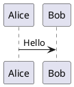
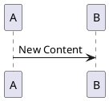
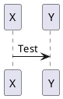
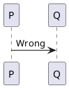
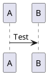
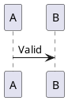
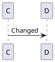
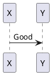
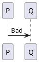
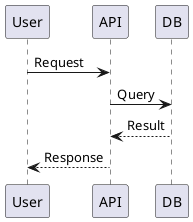

# PlantUML Plugin Acceptance Tests

## Purpose

This document defines acceptance criteria and test scenarios for the PlantUML plugin. Use it to:
- Validate all components work correctly before releasing new versions
- Perform regression testing after refactoring or bug fixes
- Onboard new contributors by demonstrating expected behavior

The PlantUML plugin provides automatic synchronization of PlantUML diagrams in markdown files through multiple integrated components:
- **Hooks** (SessionStart, PostToolUse) for automatic rule injection and synchronization
- **Scripts** (Python encoder, bash wrappers) for processing PlantUML code
- **Commands/Skills** for manual validation and diagram type selection
- **Templates** for git pre-commit hooks and CI/CD workflows

## Test Execution Order

1. **Static checks** — YAML frontmatter, hooks.json structure (automated)
2. **Unit tests** — encoder in isolation (stdin, --sync, --check) (automated)
3. **Integration tests** — hooks + scripts interaction (automated)
4. **Behavioral tests** — proactivity scenarios (partially automated, see section 8)
5. **End-to-End** — complete workflow from editing to commit (automated)

This order allows catching issues early before running more complex tests.

## Automation Status

Most tests can be run automatically by Claude Code itself:

**✅ Fully automated (Tests 1-7, 9-11):**
- Static checks (YAML, hooks.json)
- Python encoder (all modes)
- Hook integration
- Pre-commit hook behavior
- Commands/Skills structure validation
- End-to-end workflow
- Cross-platform compatibility

**🟡 Partially automated (Test 8: Proactivity):**
- Tests 8.1-8.2, 8.5-8.7: Can be automated within a session
- Test 8.3, 8.8: Static checks (automated)
- Test 8.4: Requires new session with SessionStart hook injection (manual)

See section 8.4 for detailed manual testing instructions.

---

## Test Categories

### 1. YAML Frontmatter Validation

**Objective:** Ensure all SKILL.md files comply with [agentskills.io specification](https://agentskills.io/specification)

**Files to check:**
- `commands/plantuml-validate/SKILL.md`
- `skills/plantuml-diagram-guide/SKILL.md`

**Acceptance criteria:**
- ✅ Both files have valid YAML frontmatter
- ✅ Required fields present: `name`, `description`
- ✅ YAML syntax is valid (parseable)

**Test commands:**
```bash
# Check for frontmatter presence
head -n 10 commands/plantuml-validate/SKILL.md
head -n 10 skills/plantuml-diagram-guide/SKILL.md

# Validate YAML syntax (requires yq or similar)
sed -n '/^---$/,/^---$/p' commands/plantuml-validate/SKILL.md | yq eval - > /dev/null
```

---

### 2. Python Encoder Testing

**Objective:** Verify all three operation modes of `plantuml-encode.py`

#### 2.1 stdin Mode (Encoding)

**Test case:** Encode raw PlantUML code to URL

**Steps:**
```bash
echo '@startuml
Alice -> Bob: Test
@enduml' | python3 scripts/plantuml-encode.py
```

**Expected output:**
```
https://www.plantuml.com/plantuml/svg/SoWkIImgAStDuNBCoKnELT2rKt3AJx9I24ajBk5oICrB0Ke10000
```

**Acceptance criteria:**
- ✅ Outputs valid PlantUML URL
- ✅ Default format is SVG (`/svg/` in URL)
- ✅ With `--format png`, outputs PNG URL (`/png/` in URL)

---

#### 2.2 --sync Mode (Auto-fix)

**Test case 1:** Add missing URL

**Steps:**
```bash
cat > test-missing.md << 'EOF'
# Test




No URL here yet.
EOF

python3 scripts/plantuml-encode.py --sync test-missing.md
cat test-missing.md
```

**Expected result:**
- ✅ URL is inserted after the PlantUML code block
- ✅ File reports "Updated: test-missing.md"
- ✅ Image link format: ``

**Test case 2:** Update stale URL

**Steps:**
```bash
cat > test-stale.md << 'EOF'



EOF

python3 scripts/plantuml-encode.py --sync test-stale.md
cat test-stale.md
```

**Expected result:**
- ✅ URL is replaced with correct encoding
- ✅ File reports "Updated: test-stale.md"
- ✅ Raw PlantUML code remains unchanged

---

#### 2.3 --check Mode (Validation)

**Test case 1:** Valid file

**Steps:**
```bash
# Create a valid file using --sync
cat > valid.md << 'EOF'



EOF
python3 scripts/plantuml-encode.py --sync valid.md

# Now validate
python3 scripts/plantuml-encode.py --check valid.md
echo "Exit code: $?"
```

**Expected result:**
- ✅ Exit code 0 (success)
- ✅ Output: "All PlantUML diagrams are in sync across 1 file(s)."

**Test case 2:** Invalid file (stale URL)

**Steps:**
```bash
cat > error.md << 'EOF'



EOF

python3 scripts/plantuml-encode.py --check error.md 2>&1
echo "Exit code: $?"
```

**Expected result:**
- ✅ Exit code 1 (error)
- ✅ stderr output includes:
  - "PLANTUML SYNC ERRORS: 1 issue(s) found"
  - File path and line number
  - Descriptive error message
  - Fix command: `plantuml-encode.py --sync <file>`

---

### 3. PostToolUse Hook Testing

**Objective:** Verify automatic synchronization after editing `.md` files

**Test setup:**
```bash
export CLAUDE_PLUGIN_ROOT="/path/to/plugins/plantuml"
```

**Test case 1:** Hook triggers on .md file

**Steps:**
```bash
# Create test markdown with PlantUML
cat > hook-test.md << 'EOF'



EOF

# Simulate PostToolUse hook call
echo '{"tool_input":{"file_path":"hook-test.md"}}' | bash "${CLAUDE_PLUGIN_ROOT}/scripts/sync-plantuml.sh"

# Verify URL was added
cat hook-test.md
```

**Expected result:**
- ✅ Hook executes without error
- ✅ Calls `plantuml-encode.py --sync` on the file
- ✅ URL is added to the markdown file

**Test case 2:** Hook ignores non-.md files

**Steps:**
```bash
echo '{"tool_input":{"file_path":"test.txt"}}' | bash "${CLAUDE_PLUGIN_ROOT}/scripts/sync-plantuml.sh"
echo "Exit code: $?"
```

**Expected result:**
- ✅ Hook exits with code 0
- ✅ No encoder call (silent, no output)

---

### 4. SessionStart Hooks Testing

#### 4.1 inject-base-rules.sh

**Objective:** Verify SessionStart hook outputs correct base rules

**Steps:**
```bash
bash scripts/inject-base-rules.sh
```

**Expected result:**
- ✅ Outputs ~140 tokens of markdown text
- ✅ Contains section: "PlantUML Diagrams in Markdown — Base Rules"
- ✅ Describes two-part format (code block + image link)
- ✅ Includes example code
- ✅ Contains "Proactive usage" section with:
  - Instruction to proactively add diagrams when creating/updating `.md` files
  - Instruction to use `plantuml-diagram-guide` skill for type selection
  - Instruction to render diagrams as ASCII art when explaining in terminal

**Acceptance criteria:**
- ✅ Proactive usage instructions do NOT require explicit user request
- ✅ Trigger phrases present: "When creating or updating", "When explaining"

---

#### 4.2 setup-project.sh

**Objective:** Verify pre-commit hook installation

**Test case 1:** Install in new git repo

**Steps:**
```bash
mkdir test-repo && cd test-repo
git init
git config user.email "test@test.com"
git config user.name "Test"

CLAUDE_PLUGIN_ROOT="/path/to/plugins/plantuml" \
CLAUDE_PROJECT_DIR="." \
bash "${CLAUDE_PLUGIN_ROOT}/scripts/setup-project.sh"

# Check results
test -f .githooks/pre-commit && echo "✓ Hook file created"
test -x .githooks/pre-commit && echo "✓ Hook is executable"
test "$(git config core.hooksPath)" = ".githooks" && echo "✓ Git config set"
```

**Expected result:**
- ✅ `.githooks/pre-commit` file created
- ✅ File is executable (chmod +x)
- ✅ Git config `core.hooksPath` set to `.githooks`

**Test case 2:** Idempotency

**Steps:**
```bash
# Run setup-project.sh again in the same repo
CLAUDE_PLUGIN_ROOT="/path/to/plugins/plantuml" \
CLAUDE_PROJECT_DIR="." \
bash "${CLAUDE_PLUGIN_ROOT}/scripts/setup-project.sh"

echo "Exit code: $?"
```

**Expected result:**
- ✅ Exit code 0 (success)
- ✅ Hook file remains unchanged (no overwrite if identical)
- ✅ Git config remains unchanged

**Test case 3:** Non-git directory

**Steps:**
```bash
mkdir non-git-dir && cd non-git-dir
CLAUDE_PLUGIN_ROOT="/path/to/plugins/plantuml" \
CLAUDE_PROJECT_DIR="." \
bash "${CLAUDE_PLUGIN_ROOT}/scripts/setup-project.sh"

echo "Exit code: $?"
test -d .githooks && echo "ERROR: Hook installed in non-git dir" || echo "✓ Correctly skipped"
```

**Expected result:**
- ✅ Exit code 0 (silent skip)
- ✅ No `.githooks` directory created

---

### 5. Pre-commit Hook Testing

**Objective:** Verify git pre-commit hook blocks commits with stale URLs

**Test setup:**
```bash
# Use repo from test 4.2 with pre-commit hook installed
cd test-repo
```

**Test case 1:** Valid diagram allows commit

**Steps:**
```bash
cat > valid-diagram.md << 'EOF'



EOF

# Sync to add correct URL
python3 /path/to/plantuml-encode.py --sync valid-diagram.md

git add valid-diagram.md
git commit -m "Add valid diagram"
echo "Exit code: $?"
```

**Expected result:**
- ✅ Exit code 0 (commit succeeds)
- ✅ Pre-commit output: "All PlantUML diagrams are in sync"

**Test case 2:** Stale URL blocks commit

**Steps:**
```bash
cat > invalid-diagram.md << 'EOF'



EOF

git add invalid-diagram.md
git commit -m "Try to commit invalid diagram" 2>&1
echo "Exit code: $?"
```

**Expected result:**
- ✅ Exit code 1 (commit blocked)
- ✅ stderr output includes:
  - "PLANTUML SYNC ERRORS: 1 issue(s) found"
  - File path and issue description
  - "Commit blocked. Fix with: python3 .../plantuml-encode.py --sync <file>"

**Test case 3:** Fix and commit succeeds

**Steps:**
```bash
python3 /path/to/plantuml-encode.py --sync invalid-diagram.md
git add invalid-diagram.md
git commit -m "Fixed diagram"
echo "Exit code: $?"
```

**Expected result:**
- ✅ Exit code 0 (commit succeeds)
- ✅ URL has been updated to match raw code

---

### 6. `/plantuml-validate` Command Testing

**Objective:** Verify manual validation workflow

**Test setup:**
```bash
# Create project with multiple markdown files
mkdir validation-test && cd validation-test
git init
```

**Steps:**
```bash
# 1. Create files with mixed validity
cat > good.md << 'EOF'



EOF
python3 /path/to/plantuml-encode.py --sync good.md

cat > bad.md << 'EOF'



EOF

# 2. Find all .md files with PlantUML
grep -rl '```plantuml' . --include='*.md'

# 3. Run validation check
python3 /path/to/plantuml-encode.py --check good.md bad.md 2>&1

# 4. Offer auto-fix (manual step in real usage)
python3 /path/to/plantuml-encode.py --sync bad.md

# 5. Verify fix
python3 /path/to/plantuml-encode.py --check good.md bad.md
```

**Expected result:**
- ✅ Step 2: Finds both `good.md` and `bad.md`
- ✅ Step 3: Reports error on `bad.md`, success on `good.md`
- ✅ Step 4: Updates `bad.md` with correct URL
- ✅ Step 5: All files pass validation

**Acceptance criteria:**
- ✅ Command performs all 4 steps from SKILL.md:
  1. Find `.md` files with PlantUML
  2. Run `--check` on all
  3. Report results
  4. Offer `--sync` for fixes

---

### 7. `plantuml-diagram-guide` Skill Testing

**Objective:** Verify skill contains complete diagram catalog

**Steps:**
```bash
# Check skill structure
cat skills/plantuml-diagram-guide/SKILL.md

# Count diagram types
grep -E '^\| \*\*' skills/plantuml-diagram-guide/SKILL.md | wc -l

# Verify categories
grep -E '^## ' skills/plantuml-diagram-guide/SKILL.md
```

**Expected result:**
- ✅ Contains 17 rows (16 diagram types + header row)
- ✅ Four main categories present:
  - Behavioral Diagrams (how things work)
  - Structural Diagrams (how things are built)
  - Data & Structure Visualization
  - Project Management & Planning
- ✅ Quick Selection Guide section with questions → diagram type mappings
- ✅ Each diagram type has:
  - When to use
  - When to suggest
  - Syntax example

**Diagram types checklist:**
- [ ] Sequence
- [ ] Activity
- [ ] State
- [ ] Use Case
- [ ] Timing
- [ ] Component / Package
- [ ] Class
- [ ] Object
- [ ] ER (Entity-Relationship)
- [ ] Deployment
- [ ] Network (nwdiag)
- [ ] JSON
- [ ] YAML
- [ ] MindMap
- [ ] Gantt
- [ ] WBS
- [ ] Wireframe (Salt)

---

### 8. Proactivity Testing

**Objective:** Verify Claude proactively uses the skill and adds diagrams without explicit user requests

This is the **most critical** acceptance test, as proactive behavior is a core feature differentiating this plugin from passive tools.

**Automation status:**
- ✅ Tests 8.1-8.2, 8.5-8.7: Can be automated by asking Claude to simulate scenarios within a session
- ✅ Tests 8.3, 8.8: Static checks (fully automated)
- ⚠️ Test 8.4: Requires manual testing in a fresh session (see detailed instructions below)

**Automated test results (current session):**

To verify proactivity works in the current implementation, tests 8.1, 8.2, 8.6, and 8.7 were run automatically:

| Test | Scenario | Result |
|------|----------|--------|
| 8.6 | Create README.md for auth service | ✅ PASS: Invoked skill, added Sequence diagram proactively |
| 8.7 | Explain "How does encoder work?" | ✅ PASS: Invoked skill, created Activity diagram in response |
| 8.1 | "Document API workflow" | ✅ PASS: Invoked skill, chose Sequence, explained choice |
| 8.2 | "Create sequence diagram" (type specified) | ✅ PASS: Did NOT invoke skill, created diagram directly |

**Conclusion:** Proactivity mechanisms work correctly. Tests 8.3 and 8.8 (static checks) also passed. Only test 8.4 (SessionStart injection verification) requires manual testing in a fresh session.

---

#### 8.1 Positive Cases (Claude MUST suggest skill)

**Automation:** These tests can be run by Claude itself within a session. Simply ask Claude to simulate the user queries below and verify the expected behavior occurs.

**Example automated test:**
```
User (to Claude): "Simulate this scenario: A user asks 'I need to document the API workflow'.
Show me your response and verify you invoke the plantuml-diagram-guide skill first."
```

**Test scenario 1:** Ambiguous documentation request

**User query:** "I need to document the API workflow"

**Expected behavior:**
- ✅ Claude invokes `plantuml-diagram-guide` skill BEFORE creating diagram
- ✅ Chooses between Sequence (for interaction flow) or Activity (for algorithmic flow)
- ✅ Explains choice briefly
- ✅ Creates diagram with correct syntax
- ✅ Does NOT ask user "which diagram type do you want?" — decides autonomously

**Test scenario 2:** Database schema documentation

**User query:** "Add a diagram for the database schema"

**Expected behavior:**
- ✅ Claude invokes skill
- ✅ Chooses between ER, Class, or Object diagram
- ✅ Suggests ER diagram for relational databases
- ✅ Creates diagram proactively

**Test scenario 3:** System architecture documentation

**User query:** "Create documentation for the system architecture"

**Expected behavior:**
- ✅ Claude invokes skill
- ✅ Chooses Component, Deployment, or Network diagram
- ✅ Adds diagram to documentation automatically

**Test scenario 4:** Explicit type selection question

**User query:** "How should I show state transitions?"

**Expected behavior:**
- ✅ Claude invokes skill
- ✅ Compares State, Activity, and Sequence diagrams
- ✅ Recommends State diagram for state machines
- ✅ Explains differences

---

#### 8.2 Negative Cases (Claude MUST NOT suggest skill)

**Test scenario 1:** Type already specified

**User query:** "Create a sequence diagram for the login flow"

**Expected behavior:**
- ❌ Does NOT invoke `plantuml-diagram-guide` skill
- ✅ Directly creates sequence diagram
- **Reason:** Diagram type explicitly stated, no selection needed

**Test scenario 2:** Validation task

**User query:** "Update PlantUML URLs in README.md"

**Expected behavior:**
- ❌ Does NOT invoke `plantuml-diagram-guide`
- ✅ Invokes `plantuml-validate` command instead
- **Reason:** Task is validation, not diagram creation

**Test scenario 3:** Syntax fix

**User query:** "Fix syntax error in the activity diagram"

**Expected behavior:**
- ❌ Does NOT invoke skill
- ✅ Fixes syntax directly
- **Reason:** Diagram type known, problem is technical

---

#### 8.3 Trigger Signal Validation

**Objective:** Verify skill description contains clear trigger signal

**Check:**
```bash
grep -A 3 "^description:" skills/plantuml-diagram-guide/SKILL.md
```

**Expected result:**
```yaml
description: >
  Comprehensive catalog of PlantUML diagram types with selection guidance.
  Use when choosing which diagram type fits a documentation task — covers
  sequence, activity, state, class, ER, component, and 10 more types.
```

**Acceptance criteria:**
- ✅ Contains "Use when..." phrase (explicit trigger)
- ✅ Specifies context: "choosing which diagram type fits"
- ✅ Lists diagram coverage (shows breadth)
- ❌ Anti-pattern: "Diagram type catalog" (no trigger signal)

---

#### 8.4 SessionStart Injection Verification

**Objective:** Verify base rules are injected into Claude's system prompt at session start

**⚠️ This test MUST be performed manually in a fresh session** because:
- SessionStart hooks only run when Claude Code starts a new session
- Current session already has rules loaded, so re-testing would be invalid
- This verifies the complete end-to-end integration (not just script output)

**Manual test procedure:**

**Step 1: Start a fresh Claude Code session**

Open a new terminal and navigate to any git repository (or create a test one):
```bash
mkdir /tmp/plantuml-sessionstart-test
cd /tmp/plantuml-sessionstart-test
git init
```

Start Claude Code:
```bash
claude code
```

**Expected result:** SessionStart hooks should run automatically. You won't see direct output, but the hooks execute in the background.

---

**Step 2: Verify base rules are present**

Ask Claude this exact question:
```
What are the rules for PlantUML diagrams in markdown files?
```

**Expected response should include:**
- ✅ Mention of "two parts" format (code block + image link)
- ✅ Reference to SVG format by default
- ✅ Instruction to "proactively add PlantUML diagrams when creating or updating .md files"
- ✅ Mention of the `plantuml-diagram-guide` skill
- ✅ Instruction to render diagrams as ASCII art when explaining in terminal

**Example expected response:**
```
PlantUML diagrams must have two parts:
1. A fenced code block with the `plantuml` language tag
2. An image link pointing to the rendered diagram on plantuml.com

I should proactively add PlantUML diagrams when creating or updating
.md documentation files, and use the plantuml-diagram-guide skill to
choose the right diagram type.
```

---

**Step 3: Test proactive diagram addition**

Ask Claude:
```
Create a README.md file documenting a simple authentication system
```

**Expected behavior:**
- ✅ Claude creates README.md
- ✅ README includes a PlantUML diagram (Sequence or Activity) WITHOUT you requesting it
- ✅ Claude mentions using `plantuml-diagram-guide` skill or explains diagram type choice
- ✅ Diagram has both code block and image URL

---

**Step 4: Verify PostToolUse hook integration**

Check the created README.md:
```bash
cat README.md
```

**Expected result:**
- ✅ PlantUML code block is present
- ✅ Image URL is present immediately after the code block
- ✅ URL format: ``

---

**Step 5: Verify MANDATORY skill invocation**

The most critical aspect of SessionStart injection is ensuring Claude **automatically invokes** the `plantuml-diagram-guide` skill before creating any PlantUML diagram.

Ask Claude:
```
create docs/architecture.md with a description of simple client-server architecture
```

**Expected behavior:**
- ✅ Claude explicitly invokes the skill: `⏺ Skill(plantuml:plantuml-diagram-guide)`
- ✅ Skill invocation happens BEFORE writing any PlantUML code
- ✅ Claude may explain diagram type choice based on skill recommendations
- ✅ Multiple diagrams are created (Component, Sequence, Deployment are common for this prompt)
- ✅ All diagrams have correct two-part format

**Test results from issue [#28](https://github.com/Tribe-Coding/claude-plugins/issues/28):**

| Test | Model | Skill invoked? | Notes |
|------|-------|----------------|-------|
| Fresh session test 1 | Opus 4.6 | ✅ Yes | Showed `⏺ Skill(plantuml:plantuml-diagram-guide)` |
| Fresh session test 2 | Sonnet 4.5 | ✅ Yes | Showed `⏺ Skill(plantuml:plantuml-diagram-guide)` |
| Initial test (invalid) | Sonnet 4.5 | ❌ No | API timeout (32K token limit exceeded) |

**Conclusion:** SessionStart MANDATORY instruction works correctly on both Opus 4.6 and Sonnet 4.5 when tested in fresh sessions without environmental issues.

---

**Known failure modes:**

If the skill does NOT invoke in your test, this may be due to:

1. **API timeout** — When output exceeds 32K tokens, Claude may skip skill invocation to complete before timeout
   - **Mitigation:** Set `CLAUDE_CODE_MAX_OUTPUT_TOKENS=64000` or generate smaller documents

2. **SessionStart hook race condition** — Hooks may execute before plugins fully load (upstream issues [#10997](https://github.com/anthropics/claude-code/issues/10997), [#19491](https://github.com/anthropics/claude-code/issues/19491))
   - **Mitigation:** Run `/clear` to restart session, or manually invoke `/plantuml-diagram-guide`

3. **Plugin not installed** — Marketplace plugin may still be downloading
   - **Verification:** Run `/skills` and confirm `plantuml:plantuml-diagram-guide` appears in list

**If skill invocation fails in your test:**
- Run `/clear` to restart the session
- Verify plugin is installed: `/skills | grep plantuml`
- Try a simpler prompt: "create docs/test.md with a sequence diagram"
- Check for API errors in Claude's response

---

If the URL is missing, the PostToolUse hook may not have fired. Check:
```bash
git log -1 --name-only
```

If no git commit exists, the SessionStart setup-project hook may not have run.

---

**Step 5: Verify skill invocation visibility**

Ask Claude:
```
Show me your conversation history for the README creation
```

**Expected response:**
- ✅ Shows that `plantuml-diagram-guide` skill was invoked
- ✅ Shows the decision-making process for diagram type selection

---

**Acceptance criteria:**
- ✅ Step 2: Claude can articulate the base rules without being told them in the conversation
- ✅ Step 3: Claude proactively adds diagrams to documentation
- ✅ Step 4: PostToolUse hook automatically syncs URLs
- ✅ Step 5: Skill invocation is visible in Claude's reasoning

**Failure modes:**

| Symptom | Root cause | Fix |
|---------|------------|-----|
| Claude doesn't know the rules (Step 2) | SessionStart hook didn't run | Check plugin installation; verify hooks.json |
| Claude creates README without diagram | Skill description trigger unclear | Update skill description |
| Diagram created but no URL | PostToolUse hook not firing | Check hooks.json matcher; verify CLAUDE_PLUGIN_ROOT |
| Claude doesn't invoke skill | Proactive instructions missing | Check inject-base-rules.sh output |

---

**Alternative: Static verification (no new session needed)**

If you cannot start a new session, verify the hook script output:
```bash
bash plugins/plantuml/scripts/inject-base-rules.sh | grep -A 5 "Proactive usage"
```

**Expected output:**
```
Proactive usage:
- When creating or updating `.md` documentation files, proactively add PlantUML diagrams...
- When explaining architecture or flows in the terminal, render diagrams as ASCII art...
- **ALWAYS invoke the `plantuml-diagram-guide` skill BEFORE creating any PlantUML diagram** to choose the correct diagram type. This is MANDATORY — do not skip this step even if you think you know which type to use.
```

**Acceptance criteria:**
- ✅ Contains **MANDATORY** instruction: "ALWAYS invoke the `plantuml-diagram-guide` skill BEFORE creating any PlantUML diagram"
- ✅ Uses imperative language: "ALWAYS", "MANDATORY", "do not skip"
- ✅ Trigger: "When creating or updating `.md`" (automatic context)
- ✅ No conditional phrasing like "if the user asks"

**Note:** This static check verifies the script output but does NOT verify the complete integration (that the rules actually get injected into Claude's system prompt).

---

#### 8.5 Proactive Behavior Simulation

**Automation:** ✅ Can be automated by Claude within a session

**Test setup:**
```bash
mkdir proactivity-test && cd proactivity-test
cat > docs/api-design.md << 'EOF'
# API Design

(empty file, to be populated)
EOF
```

**User query:** "Add a diagram for the authentication flow"

**Expected Claude behavior:**

1. **Before creating diagram:**
   - ✅ Invokes `plantuml-diagram-guide` skill
   - ✅ Reads skill to understand diagram types

2. **Decision making:**
   - ✅ Considers: Sequence (interaction flow) vs Activity (algorithmic flow)
   - ✅ Chooses Sequence diagram for authentication (user → system interaction)

3. **Output:**
   - ✅ Brief explanation: "I'll create a Sequence diagram to show the authentication flow between user and system"
   - ✅ Creates diagram with correct PlantUML syntax
   - ✅ Does NOT ask: "Which diagram type would you like?" (decides autonomously)

4. **Verification:**
   - ✅ Diagram is syntactically valid
   - ✅ URL is auto-synced by PostToolUse hook

---

#### 8.6 Proactive Diagram Addition in Documentation

**Automation:** ✅ Can be automated by Claude within a session

**Objective:** Verify Claude adds diagrams autonomously when creating documentation, even without explicit diagram request

**Test scenario 1:** README.md generation

**User query:** "Create a README.md for this repository"

**Expected behavior:**
- ✅ Claude reads project code
- ✅ Invokes `plantuml-diagram-guide` skill to choose diagram type
- ✅ Adds Component or Architecture diagram in "Architecture" section
- ✅ Does NOT ask "do you want a diagram?" — adds proactively
- **Trigger:** Creating project documentation naturally includes architecture diagrams

**Test scenario 2:** API endpoint documentation

**User query:** "Add documentation for the POST /api/users endpoint"

**Expected behavior:**
- ✅ Claude invokes skill
- ✅ Adds Sequence diagram for request/response flow OR Activity diagram for validation logic
- ✅ Explains diagram type choice
- **Trigger:** API documentation benefits from flow visualization

**Test scenario 3:** Contributing guide

**User query:** "Create CONTRIBUTING.md with project structure guide"

**Expected behavior:**
- ✅ Claude invokes skill
- ✅ Adds Class diagram or Component diagram for structure
- ✅ Places diagram in "Project Structure" section
- **Trigger:** Structural documentation benefits from visual diagrams

**Test scenario 4:** State machine documentation

**User query:** "Create docs/order-lifecycle.md"

**Expected behavior:**
- ✅ Claude analyzes order lifecycle code
- ✅ Invokes skill to choose between State, Activity, Sequence
- ✅ Adds State diagram automatically
- ✅ Syncs diagram with code
- **Trigger:** Lifecycle documentation → State diagram is standard

---

#### 8.7 Proactive Diagram Usage in Explanations

**Automation:** ✅ Can be automated by Claude within a session

**Objective:** Verify Claude uses diagrams to EXPLAIN concepts even when user only asks a question (not requesting file creation)

**Test scenario 1:** Architecture explanation

**User query:** "How does authentication work in this system?"

**Expected behavior:**
- ✅ Claude reads authentication code
- ✅ Invokes `plantuml-diagram-guide` skill
- ✅ Creates Sequence diagram directly in chat response
- ✅ Uses diagram as visual explanation of auth flow
- **Trigger:** "How does X work" questions benefit from visualization
- **Format:** PlantUML code block + rendered image URL (as per SessionStart rules)

**Test scenario 2:** Data flow explanation

**User query:** "Explain how data moves from frontend to database"

**Expected behavior:**
- ✅ Claude invokes skill
- ✅ Creates Activity or Sequence diagram
- ✅ Includes diagram in text explanation
- **Trigger:** Flow/process explanations benefit from visual representation

**Test scenario 3:** Approach comparison

**User query:** "What's the difference between approach A and approach B for this task?"

**Expected behavior:**
- ✅ Claude invokes skill
- ✅ Creates 2 diagrams for comparison (e.g., Component diagrams for different architectures)
- ✅ Visually highlights differences
- **Trigger:** Comparing complex concepts benefits from side-by-side visualization

**Test scenario 4:** Debugging explanation

**User query:** "Why isn't this code working as expected?"

**Expected behavior:**
- ✅ Claude analyzes code
- ✅ Invokes skill
- ✅ Creates Activity diagram showing actual vs expected flow
- ✅ Highlights divergence point
- **Trigger:** Debugging complex logic benefits from visual flow analysis

---

#### 8.8 SessionStart Rules Proactivity Verification

**Automation:** ✅ Fully automated (static check)

**Objective:** Verify base rules explicitly instruct proactive diagram usage

**Check:**
```bash
bash scripts/inject-base-rules.sh | grep -A 10 "Proactive usage"
```

**Expected phrases:**
- ✅ "proactively add" — NOT "if the user asks"
- ✅ "When creating or updating `.md`" — automatic trigger
- ✅ "When explaining architecture or flows" — use in responses
- ❌ Anti-pattern: "If the user asks for a diagram" — NOT proactive

**Acceptance criteria:**
- ✅ Rules do NOT require explicit user request
- ✅ Trigger contexts are described (creating docs, explaining concepts)
- ✅ Instructions are imperative ("Use the skill", not "Consider using")

---

#### 8.9 Proactivity Success Metrics

**Evaluation criteria:**

| Scenario | Success = | Failure = |
|----------|-----------|-----------|
| Generate README.md | Adds diagram WITHOUT request | Creates README without diagram AND no explanation why |
| API documentation | Adds Sequence/Activity diagram | Only text description of flow |
| "How does X work?" question | Includes diagram in response | Only text explanation |
| Compare approaches | Creates diagrams for both options | Text comparison without visualization |
| Contributing guide | Adds structural diagram (Component/Class) | Only text description of structure |

**Target frequency:** 80%+ of cases where diagram would be useful

**Minimum acceptable:** 60%+ of cases

**Quality of diagram type selection:**
- ✅ Skill invoked BEFORE creating diagram (not after)
- ✅ Chosen type matches context (e.g., Sequence for flow, State for lifecycle)
- ✅ Brief explanation of why this type was chosen

---

#### 8.10 Proactivity Test Failures

**Common failure modes to watch for:**

1. **Reactive behavior:** Claude asks "Do you want a diagram?" instead of adding one
   - **Root cause:** SessionStart rules not injected OR trigger signal unclear
   - **Fix:** Verify `inject-base-rules.sh` runs; update skill description

2. **Wrong skill invocation:** Claude uses `plantuml-validate` instead of `plantuml-diagram-guide`
   - **Root cause:** Skill descriptions overlap or are ambiguous
   - **Fix:** Ensure descriptions clearly separate validation (validate) from creation (guide)

3. **No skill invocation:** Claude creates diagram without consulting guide
   - **Root cause:** Skill trigger signal not recognized
   - **Fix:** Update skill description with clearer "Use when..." phrase

4. **Over-invocation:** Claude uses skill even when diagram type is explicitly stated
   - **Root cause:** Trigger too broad
   - **Fix:** Add negative examples to skill description (when NOT to use)

---

### 9. End-to-End Scenario

**Objective:** Validate complete workflow from editing to commit

**Steps:**
```bash
# 1. Setup new project
mkdir e2e-test && cd e2e-test
git init
git config user.email "e2e@test.com"
git config user.name "E2E Test"

# 2. SessionStart: setup-project
CLAUDE_PLUGIN_ROOT="/path/to/plugins/plantuml" \
CLAUDE_PROJECT_DIR="." \
bash "${CLAUDE_PLUGIN_ROOT}/scripts/setup-project.sh"

test -f .githooks/pre-commit && echo "✓ Step 1: Pre-commit hook installed"

# 3. SessionStart: inject-base-rules (verify output)
bash /path/to/scripts/inject-base-rules.sh | head -n 3
echo "✓ Step 2: Base rules available"

# 4. Create markdown file (simulate Write tool)
cat > README.md << 'EOF'
# E2E Test




End of file.
EOF

# 5. Simulate PostToolUse hook (in real usage, this happens automatically)
echo '{"tool_input":{"file_path":"README.md"}}' | \
CLAUDE_PLUGIN_ROOT="/path/to/plugins/plantuml" \
bash "${CLAUDE_PLUGIN_ROOT}/scripts/sync-plantuml.sh"

# 6. Verify URL was added
grep "plantuml.com" README.md && echo "✓ Step 3: URL added by hook"

# 7. Validate with /plantuml-validate command
python3 /path/to/plantuml-encode.py --check README.md && echo "✓ Step 4: Validation passed"

# 8. Commit (should succeed)
git add README.md
git commit -m "Add README with diagram"
echo "✓ Step 5: Commit succeeded"

# 9. Modify diagram without updating URL
sed -i '' 's/User -> API: Request/User -> API: Modified/' README.md

# 10. Try to commit (should block)
git add README.md
git commit -m "Modified diagram" 2>&1 | grep "PLANTUML SYNC ERRORS" && echo "✓ Step 6: Commit blocked"

# 11. Fix with --sync
python3 /path/to/plantuml-encode.py --sync README.md && echo "✓ Step 7: Auto-fix applied"

# 12. Commit after fix (should succeed)
git add README.md
git commit -m "Modified diagram (fixed)"
echo "✓ Step 8: Commit succeeded after fix"
```

**Expected output:**
```
✓ Step 1: Pre-commit hook installed
✓ Step 2: Base rules available
✓ Step 3: URL added by hook
✓ Step 4: Validation passed
✓ Step 5: Commit succeeded
✓ Step 6: Commit blocked
✓ Step 7: Auto-fix applied
✓ Step 8: Commit succeeded after fix
```

**Acceptance criteria:**
- ✅ All 8 steps complete without manual intervention (except running commands)
- ✅ PostToolUse hook automatically syncs URLs
- ✅ Pre-commit hook blocks invalid commits
- ✅ Pre-commit hook allows commits after fix
- ✅ No false positives or false negatives in validation

---

### 10. Cross-Platform Compatibility

**Objective:** Verify scripts work on both macOS and Linux

**Platform-specific considerations:**

1. **`stat` command:**
   - macOS: `stat -f %m "$file"`
   - Linux: `stat -c %Y "$file"`

2. **`date` command:**
   - macOS: `date -juf "%Y-%m-%dT%H:%M:%S" "$str" +%s`
   - Linux: `date -ud "$str" +%s`

3. **OAuth credentials:**
   - Priority order:
     1. `$CLAUDE_CODE_OAUTH_TOKEN` env var (any platform)
     2. macOS Keychain: `security find-generic-password -s "Claude Code-credentials" -w`
     3. Linux credentials file: `~/.claude/.credentials.json`

4. **Temp files:**
   - Always append `-${UID}` to avoid multi-user collisions

**Test checklist:**

```bash
# Check for platform detection
for script in scripts/*.sh; do
  echo "Checking $(basename "$script"):"
  grep -E "uname|Darwin|Linux" "$script" || echo "  No platform-specific code (OK for simple scripts)"
done

# Verify CLAUDE_PLUGIN_ROOT fallback
for script in scripts/*.sh; do
  grep "CLAUDE_PLUGIN_ROOT" "$script" | head -n 1
done
```

**Expected patterns:**

✅ **setup-project.sh:**
```bash
PLUGIN_ROOT="${CLAUDE_PLUGIN_ROOT:-$(cd "$(dirname "$0")/.." && pwd)}"
```

✅ **sync-plantuml.sh:**
```bash
PLUGIN_ROOT="${CLAUDE_PLUGIN_ROOT:-$(cd "$(dirname "$0")/.." && pwd)}"
```

✅ **inject-base-rules.sh:**
- Simple script, no env dependencies (just outputs text)

**Acceptance criteria:**
- ✅ All scripts have fallback for `CLAUDE_PLUGIN_ROOT`
- ✅ No macOS-only commands without Linux alternatives
- ✅ Scripts run successfully on both platforms

---

## Regression Testing Guide

### When to Run Tests

Run these acceptance tests:
1. **Before releasing** a new version
2. **After refactoring** any component (encoder, hooks, scripts)
3. **After fixing bugs** to ensure no new issues introduced
4. **When onboarding** new contributors (as learning material)

### CI/CD Integration

**Pre-commit hook** (runs locally):
- Blocks commits with stale PlantUML URLs (Test 5)

**GitHub Actions workflow** (runs on PR):
- See `templates/plantuml.yml` for CI configuration
- Runs `plantuml-encode.py --check` on all `.md` files
- Fails PR if any diagrams are out of sync

**Automated testing** (within Claude Code session):
- Tests 1-7, 9-11 can be run by asking Claude to execute them
- Test 8 (proactivity): automated except 8.4 which requires fresh session
- Example prompt: "Run the PlantUML acceptance tests from docs/ACCEPTANCE_TESTS.md"

**Manual testing** (before release):
- Run test 8.4 in a fresh Claude Code session (SessionStart verification)
- Verify all acceptance criteria pass
- Document any failures as issues

### Test Data Cleanup

After running tests:
```bash
# Remove test directories
rm -rf /tmp/plantuml-test-*
rm -rf /tmp/plantuml-e2e-*

# Reset git test repos if needed
rm -rf /path/to/test-repo
```

---

## Contributing

When adding new features to the PlantUML plugin:
1. Update this test document with new acceptance criteria
2. Run all existing tests to ensure no regressions
3. Add test cases for new functionality
4. Update CLAUDE.md if behavior changes

---

## Known Issues

Document any known test failures or limitations here:
- None currently

---

## References

- [Plugin Source Code](../README.md)
- [agentskills.io Specification](https://agentskills.io/specification)
- [PlantUML Official Documentation](https://plantuml.com/)
