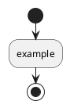

# PlantUML Validation

<!-- This document explains the diagram format, so its own examples keep the source visible. -->
<!-- plantuml-source: visible -->

Every diagram has a `plantuml` source block and an image URL below it. The source is collapsed inside a `<details>` wrapper by default, so a reader sees the diagram rather than the text that produced it. Validation covers both halves of what can go wrong, in either form.

## What is checked

**URL sync (offline).** Detects diagrams whose image URL no longer matches the source block (stale URL) or is missing entirely.

**Render lint (network).** Detects sources that PlantUML still renders but complains about — deprecated syntax and syntax errors. This matters because being *in sync* is not the same as being *correct*: a diagram can have a perfectly matching URL and still render a yellow warning box baked into the image, such as `This syntax is deprecated, you must add <<#FDE8E8>> at the end of the line, after the ';'`. The lint asks the PlantUML server to render each diagram and reads the complaints out of the response.

Deprecation warnings are served with HTTP 200 and no error headers — the only trace is the warning text in the rendered output — so the lint scans the response body rather than trusting the status code alone. A handful of known-deprecated constructs are also matched locally, which works with no network at all.

## Commands

```bash
# URL sync + render lint (the default)
python3 plantuml-encode.py --check README.md docs/*.md

# URL sync only — fully offline, no network calls
python3 plantuml-encode.py --no-lint --check README.md

# Render lint only
python3 plantuml-encode.py --lint README.md

# Lint against local deprecated-syntax patterns only, never contacting the server
python3 plantuml-encode.py --offline --lint README.md

# Show what --sync would change, as a unified diff, without writing anything
python3 plantuml-encode.py --dry-run --sync docs/*.md
```

`--check`, `--lint` and `--sync` take one or more file arguments, so any other flag must come before them — write `--no-lint --check file.md`, not `--check --no-lint file.md`.

`--dry-run` exits 1 when any file would change, so it doubles as a check that a tree is already in the form `--sync` would produce.

## Ignoring a block on purpose

Documentation sometimes has to *show* bad syntax — a counter-example in a style guide, a fixture in a test document. Such a block would otherwise block its own commit. Add a PlantUML comment anywhere inside the block to exempt it from the lint:




The exemption applies to the render lint only. URL sync is still enforced, so the block's image stays correct.

## Source visibility

A diagram's source is collapsed into a `<details>` wrapper, so the rendered page shows the diagram and one `Diagram source` line. The source stays in an ordinary fenced block inside that wrapper — which is what makes the form safe. Fence content is code text, so a literal `-->` or `</details>` in a diagram label is escaped by the renderer rather than acted on. (An HTML comment cannot hold a diagram: HTML has no escaping mechanism inside comments, so the first `-->` — ordinary PlantUML arrow syntax — ends the comment and spills the rest of the source onto the page.)

Some documents exist to *show* their source: a tutorial, a syntax reference, a fixture a test feeds back to the tool. Keep a whole document visible with a line anywhere in it:

```
<!-- plantuml-source: visible -->
```

Or keep a single diagram visible with the same comment on the line before its fence, or with `visible` in the fence info string:

    ```plantuml visible

Both markers sit outside the diagram source, so opting out never re-encodes a URL.

Two shapes are reported rather than rewritten, because rewriting them would guess at intent:

- **A half-written wrapper** — `<details>` opened but not closed, or the reverse. Close it, then re-sync.
- **A fence that is indented or inside a blockquote** — its prefix would be encoded into the diagram, and an inserted image link would land at the wrong nesting level. Move the diagram to the top level of the document.

A `<details>` you wrote yourself is left alone: only wrappers carrying the tool's own `<!-- plantuml-generated -->` marker are rewritten, so your `<summary>` text is never overwritten.

## Manual validation

Run `/plantuml:plantuml-validate` in any Claude Code session to check all `.md` files in the project. Claude will list any mismatches and offer to auto-fix them. Stale URLs are auto-fixable; deprecated syntax has to be corrected in the source block by hand, because only the author knows what the diagram was meant to say.

## Git pre-commit hook

Installed automatically on session start. Blocks commits when a diagram URL is stale or a source renders with a deprecation warning or syntax error.

The render lint needs the network. When the PlantUML server is unreachable the hook prints a warning and still lets the commit through, so working offline is never blocked — only the local pattern check runs in that case. To skip the render lint deliberately, commit with `PLANTUML_SKIP_LINT=1`.

## GitHub Actions CI

A workflow template is included at `templates/plantuml-sync.yml`. Copy it to `.github/workflows/` to run validation on every PR.
