# Mermaid Syntax Reference

Quick syntax examples for each Mermaid diagram type. For full documentation see [mermaid.js.org](https://mermaid.js.org/).

## Behavioral diagrams

### Sequence

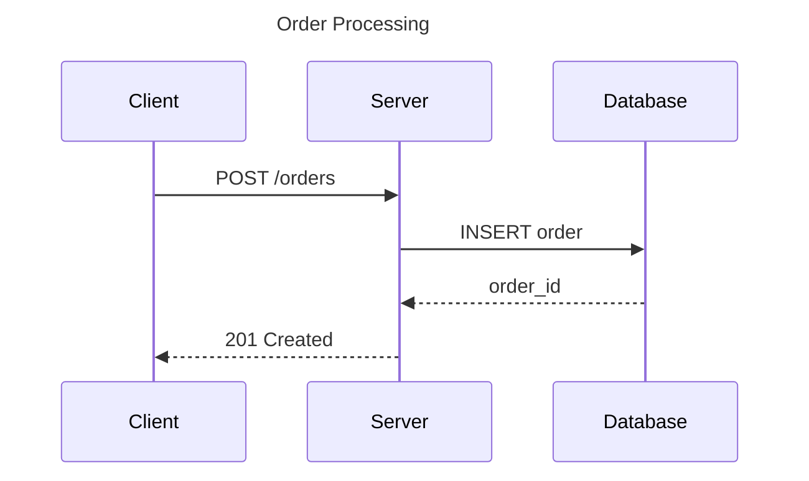

Arrow types: `->>` sync request, `-->>` sync response, `-)` async fire-and-forget, `--)` async response.

Fragments: `alt`/`else`, `opt`, `loop`, `par`, `critical`, `break`.

### Flowchart

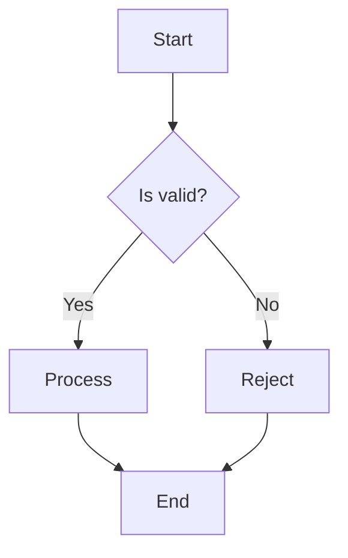

Directions: `TD` (top-down), `LR` (left-right), `BT` (bottom-top), `RL` (right-left).

Node shapes: `[rectangle]`, `(rounded)`, `{diamond}`, `([stadium])`, `[[subroutine]]`, `[(cylinder)]`, `((circle))`.

### State

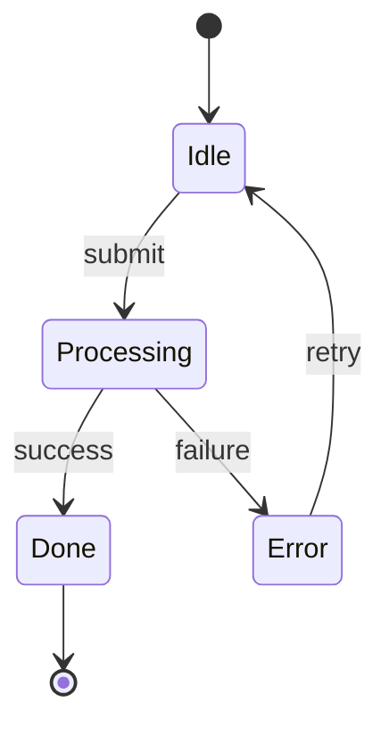

Use `stateDiagram-v2` (not `stateDiagram`). Supports composite states, forks, joins, notes.

### Journey

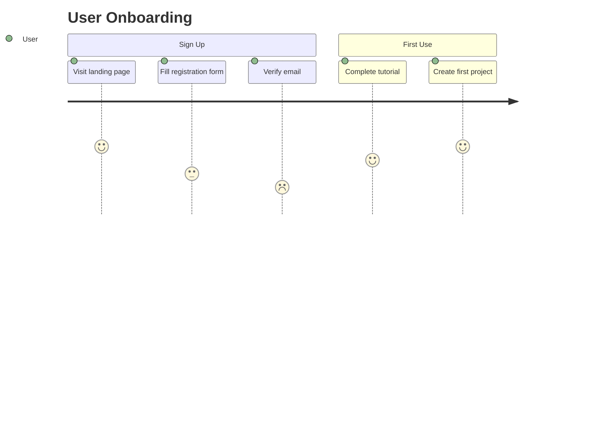

Numbers 1-5 represent satisfaction (1 = frustrating, 5 = great).

## Structural diagrams

### Class

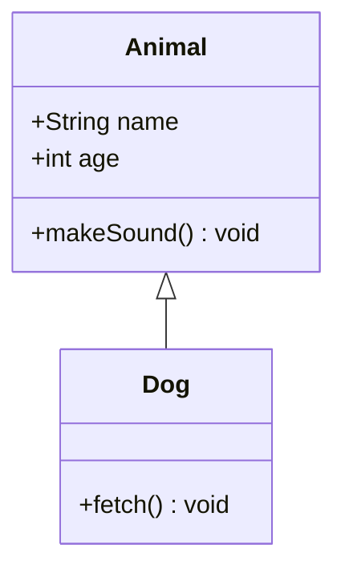

Relationships: `<|--` inheritance, `*--` composition, `o--` aggregation, `-->` association, `..>` dependency, `..|>` realization.

### ER (Entity-Relationship)

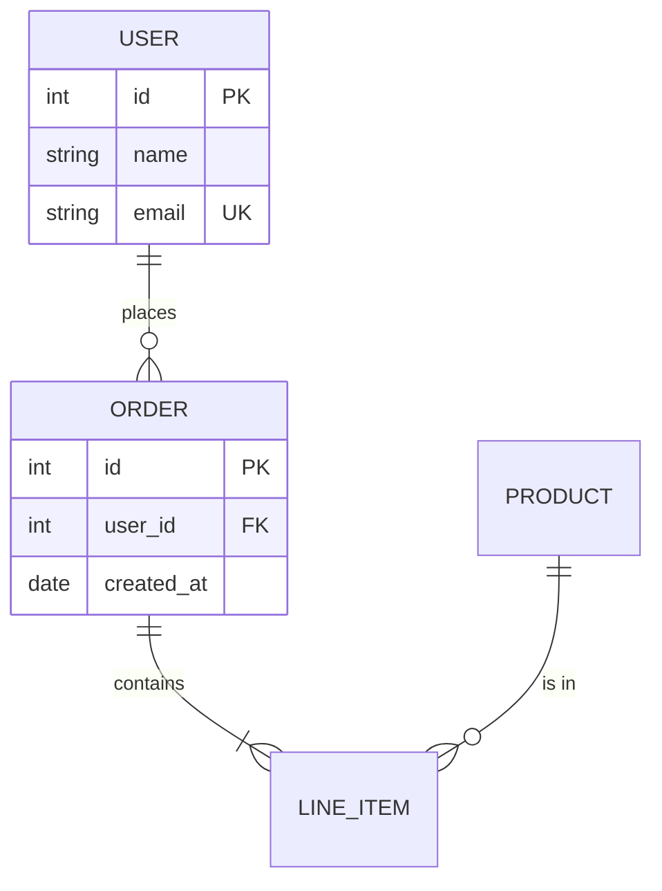

Cardinality: `||` exactly one, `o|` zero or one, `}|` one or more, `}o` zero or more.

### Block

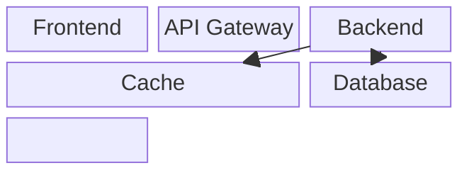

### Requirement

```mermaid
requirementDiagram
    requirement auth_req {
        id: REQ-001
        text: System shall authenticate users via OAuth2
        risk: medium
        verifymethod: test
    }
    element auth_module {
        type: module
    }
    auth_module - satisfies -> auth_req
```

## Data and visualization

### Pie

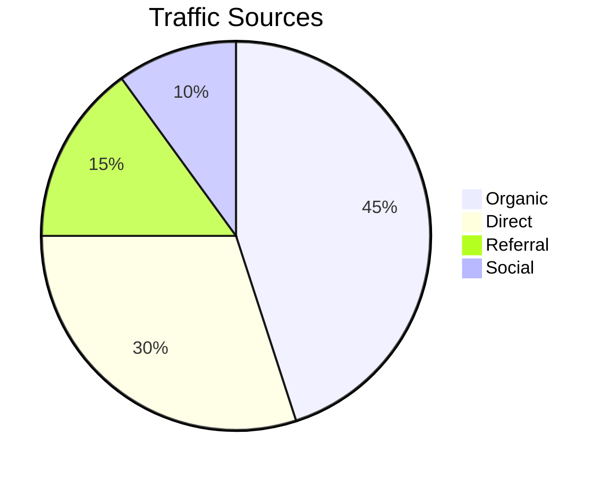

### XY Chart

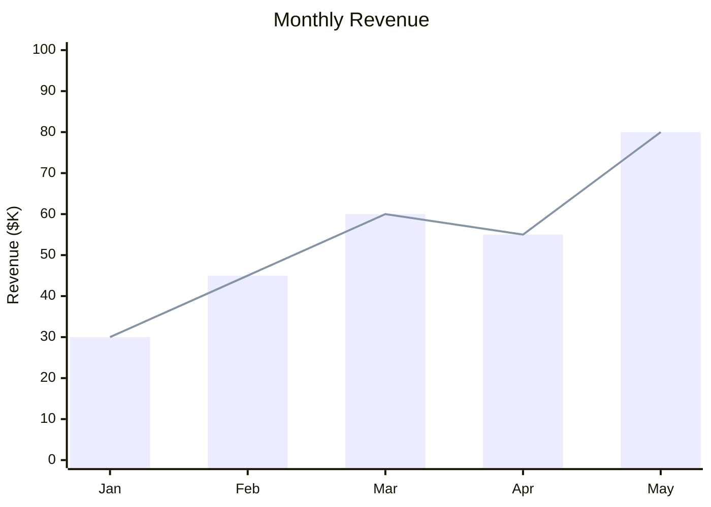

### Sankey

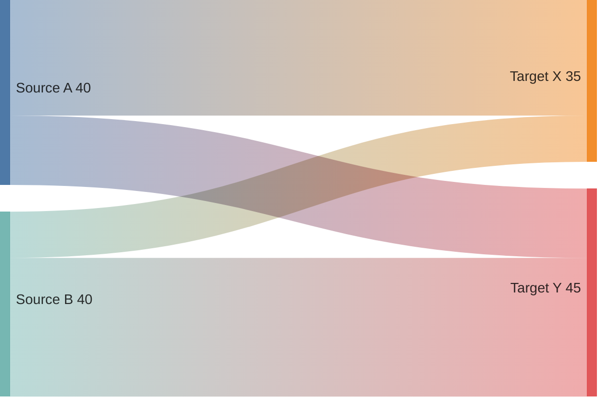

### Quadrant

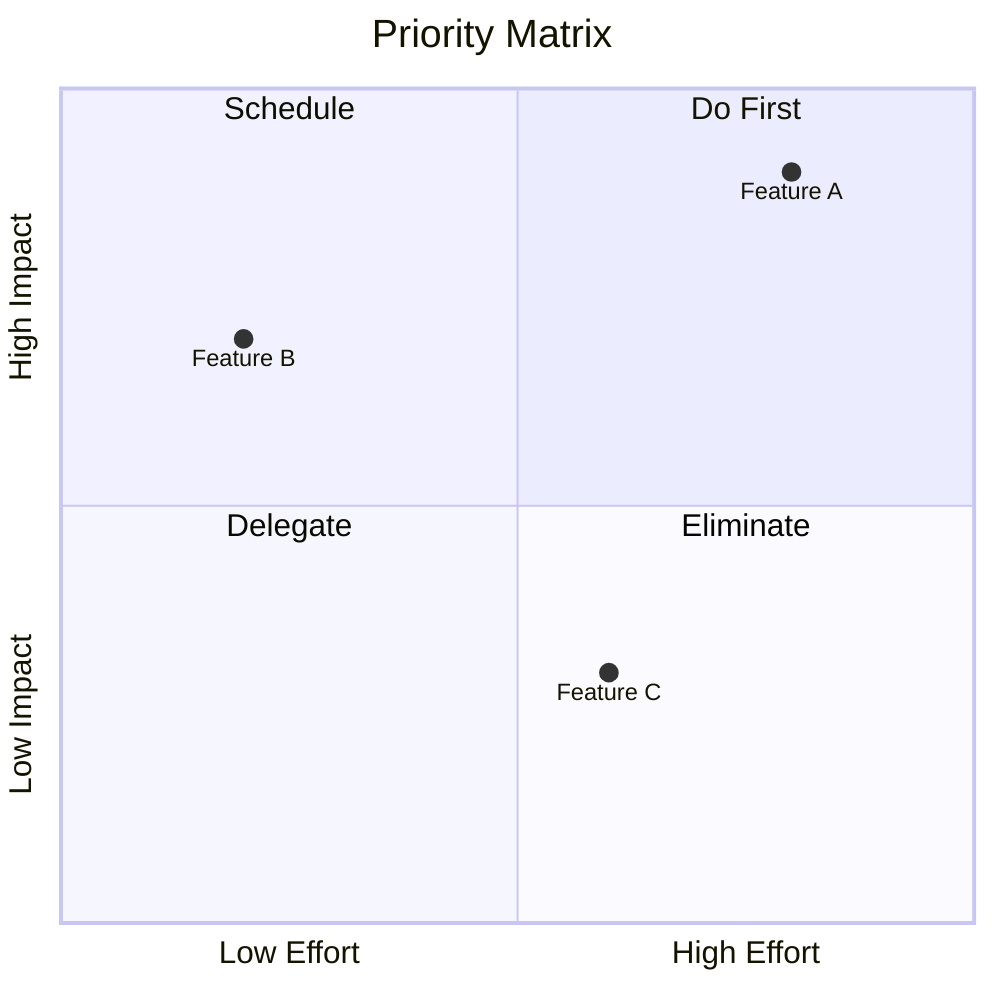

## Project management and planning

### MindMap

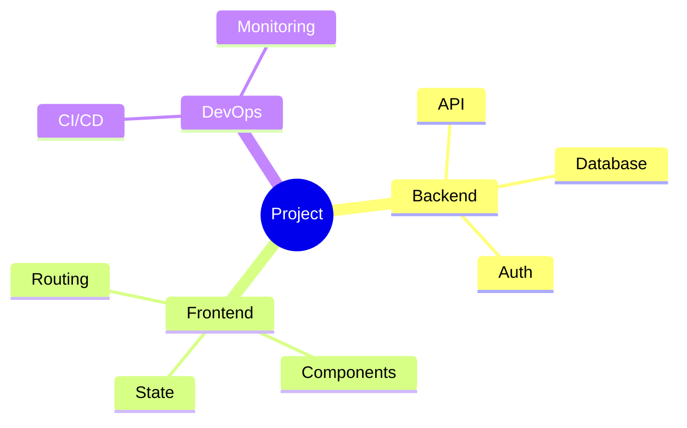

### Gantt

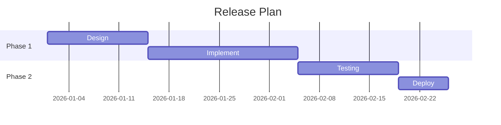

### Timeline

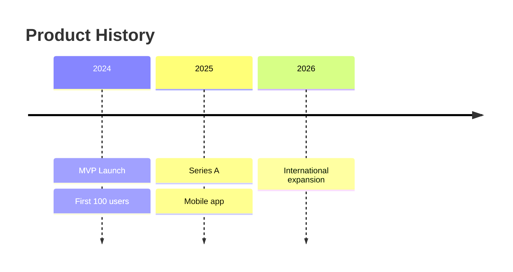

### GitGraph

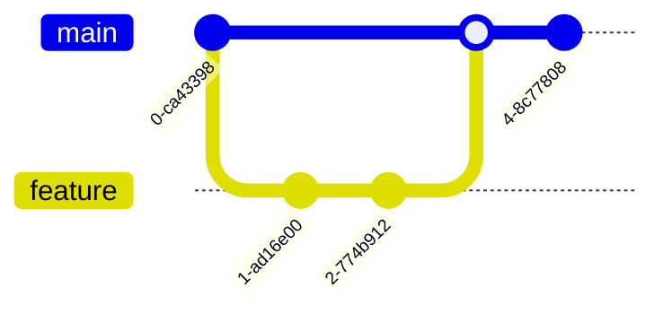
