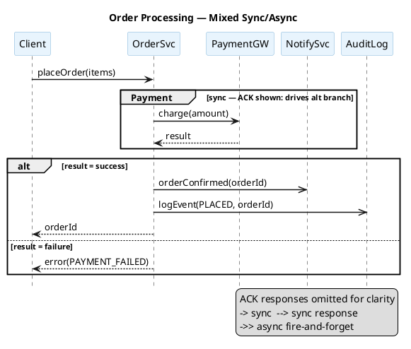

# Sequence Diagram Reference

## Visual Styling Boilerplate

Include these two skinparams in every sequence diagram immediately after `@startuml`:

```
skinparam sequenceArrowThickness 1.5
skinparam LifeLineBorderColor #C0C0C0
```

- `sequenceArrowThickness 1.5` — thicker message arrows for better visibility (default 1 is same weight as lifelines)
- `LifeLineBorderColor #C0C0C0` — gray lifelines visually recede, making message arrows the focal point

## Arrow Style Conventions

| Arrow | Meaning |
|-------|---------|
| `->` | Synchronous request (caller blocks until response) |
| `-->` | Synchronous response (return value / ACK) |
| `->>` | Async fire-and-forget (caller continues immediately) |
| `-->>` | Async callback / response to async request |

## ACK Response Arrow Rules

### Suppress return arrow when:
- One-directional info flow: events, notifications, logs, metrics, webhooks
- Sender does **not** branch on the result (no `alt`/`opt`/`loop` that depends on response)
- Use `->>` (async) for fire-and-forget; omit the return arrow entirely

### Show return arrow when:
- Missing ACK would make a subsequent `alt`/`opt`/`loop` fragment nonsensical
- Error handling, retry logic, or branching depends on the response
- The caller's next action is determined by the response value

### Decision test
> "If I remove this return arrow, does any later `alt`/`opt`/`loop` fragment become nonsensical?"
> — **Yes** → arrow must stay. **No** → suppress it.

### Decision table

| Scenario | Arrow? | Rationale |
|----------|--------|-----------|
| HTTP 200 ACK for an analytics event | ❌ Suppress | Sender never branches on result |
| Payment gateway response | ✅ Show | Drives `alt [success] / [failure]` branch |
| Webhook delivery notification | ❌ Suppress | Fire-and-forget; use `->>` |
| DB write confirmation driving retry | ✅ Show | `loop` retries on failure |
| Log entry written to sink | ❌ Suppress | Pure side-effect, no branching |
| Auth token validation result | ✅ Show | `opt [invalid]` branch follows |

When ACK arrows are suppressed, add a legend:

```plantuml
legend right
  ACK responses omitted for clarity
  -> sync request  --> sync response
  ->> async fire-and-forget
end legend
```


## Group Fragment Guidance

Use `group` fragments to cluster related request-response pairs in dense diagrams:

```plantuml
group Payment Processing
  Client -> PaymentGW: charge(amount)
  PaymentGW --> Client: result
end
```


Reserve `group` for logical sub-flows with 3+ messages. For simple pairs, `group` adds noise.

## Example: Mixed Sync/Async Flow




