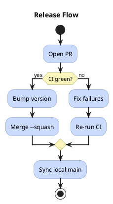
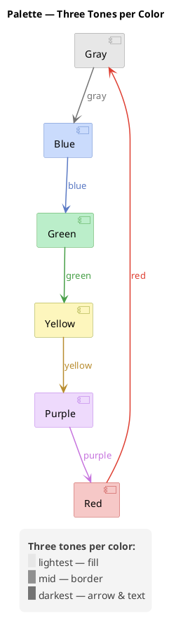
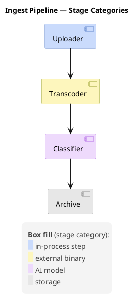

# Visual Styling Guidelines

## Arrow Thickness

**MANDATORY:** Never leave arrows at the default thickness. At the default `1` an arrow carries the same visual weight as element borders and lifelines, so the flow — the thing the diagram exists to show — is no longer what the eye finds first.

Set the thickness immediately after the opening tag, next to `title`:

| Diagram type | Skinparam |
|--------------|-----------|
| Sequence | `skinparam sequenceArrowThickness 1.5` |
| Activity, State, Class, Component, Object, Use Case, Deployment, ER | `skinparam ArrowThickness 1.5` |
| Timing, Network, MindMap, Gantt, WBS, JSON, YAML, Wireframe (Salt) | Not supported — omit |

`1.5` is the standard value; use it unless you have a specific reason not to. Do not go higher: at `2` a dashed implementation arrow (`<|..`) renders nearly solid, blurring the distinction from inheritance (`<|--`).

Sequence diagrams use their own skinparam — `ArrowThickness` has no effect there. They also need `skinparam LifeLineBorderColor #C0C0C0`, so that the lifelines recede and the messages stay the focal point.

### Example: non-sequence diagram




## Color Coding

Use color coding to improve diagram readability. Apply a **muted pastel palette** on white background (default). Do NOT set `skinparam backgroundColor` unless the user explicitly requests it.

**Recommended palette:**

Each color comes in **three tones**, one per role. Take all three from the same row — mixing rows breaks the visual link between a block, its outline, and the arrows leaving it.

| Color | Fill | Border | Arrow & text | Use for |
|-------|------|--------|--------------|---------|
| Blue | `#CADBFC` | `#6287CD` | `#5A79C4` | Primary elements, main flow |
| Green | `#BBEECA` | `#4DA64B` | `#479F47` | Success paths, approved states |
| Red | `#F6C8C7` | `#C3403C` | `#DE3E31` | Error paths, rejected states |
| Yellow | `#FDF6BD` | `#99A02C` | `#B88C2E` | Warnings, pending states |
| Purple | `#EEDAFC` | `#B56FE7` | `#C673DE` | External systems, third-party |
| Gray | `#E7E7E7` | `#909090` | `#737373` | Inactive, deprecated |

**Fill** is the block's background, **border** its outline, **arrow & text** the color for connectors leaving that block and for any colored text on the white canvas.

**When a diagram uses more than one palette color, set fill and border together per element** — `[Transcoder] #FDF6BD;line:99A02C`, or `rectangle "X" #F6C8C7;line:C3403C`. The `skinparam ComponentBorderColor` family sets *one* border color for every element of that kind, so a diagram whose fills vary per element ends up with all of them outlined in the same color — the pairing silently stops holding. Reserve the skinparam form for diagrams that genuinely use a single color throughout.

**Color an arrow with the third tone when it belongs to a colored element** — `up -[#5A79C4]-> tr`. An uncolored arrow between two colored blocks reads as unrelated to either; the third tone ties it to its source. Leave arrows uncolored on diagrams that use no color at all.

**The third tone also colors text on the white canvas** — arrow labels, notes, any inline `<color:…>` span. Use the same hex for both: `bl -[#5A79C4]-> gn : <color:#5A79C4>fetch`. Applying it to the label as well as the line keeps the pair reading as one statement.

**Colored text is for short labels, not body copy.** Only gray `#737373` (4.74:1) clears the WCAG AA 4.5:1 threshold for normal-size text on white. Blue `#5A79C4` (4.23:1) and red `#DE3E31` (4.34:1) sit just under it; green `#479F47` (3.32:1), yellow `#B88C2E` (3.08:1) and purple `#C673DE` (3.04:1) clear only the 3:1 large-text threshold. The tones are tuned for 1.5px strokes against pastel fills, where they read cleanly — as small text on white they are noticeably lighter. Keep colored text to a word or two carrying redundant meaning the diagram already shows in another way, and never as the only way a reader can learn something.

**The tones do not form a strict light-to-dark ramp.** Fill is always the lightest, but the arrow tone is darker than the border only for gray and blue; in the other four rows it is lighter, more saturated, or both. The third column is defined by its role — arrows and text — not by being the darkest value in the row. Do not "fix" a row to restore monotonic lightness.

### Example: all three tones




The fills are deliberately darker than a plain pastel: against the `#F4F4F4` legend background (and on white), a fill any lighter stops reading as a distinct block and legend swatches lose their edge. Gray is the closest call — its `#E7E7E7` fill sits near the legend panel's own tone, and it is the `#909090` border that keeps the swatch legible.

**Color support by diagram type:**

| Support | Types |
|---------|-------|
| ✅ Full (skinparam, arrows, groups) | Sequence, Activity, State, Class, Component, Object, ER, Deployment |
| 🟡 Limited | Timing, Network, MindMap, Gantt, WBS |
| ❌ Not supported | JSON, YAML, Wireframe (Salt) |

**When NOT to color:**
- Diagram has only 2–3 simple elements (coloring adds noise)
- JSON, YAML, or Wireframe diagrams (no skinparam support)

## Legend

**When to add a `legend`:**
- Colors encode specific meaning (error/success, internal/external, sync/async)
- Diagram has 5+ elements with distinct color-coded roles
- Arrow styles carry a convention the diagram does not spell out (see `references/sequence.md` for ACK suppression)

Every legend gets these three skinparams:

```
skinparam legendBackgroundColor #F4F4F4
skinparam legendBorderColor transparent
skinparam LegendFontColor #404040
```

**`LegendFontColor #404040`** — PlantUML renders legend text in pure black, which outweighs the diagram it annotates: element borders and arrow labels are drawn in subtler tones, so the legend — a footnote by intent — becomes the highest-contrast object on the canvas and pulls the eye away from the flow. Dark grey stays fully readable while giving the legend the visual weight of a caption. Set it as a skinparam rather than wrapping each line in `<color:#404040>`: one declaration covers the whole block, and a line added later cannot be forgotten. `#404040` is the standard value — lighter (`#808080` and up) is hard to read at small render sizes, darker defeats the point.

**`legendBorderColor transparent`** — drops the black 1px frame. The frame is the heaviest stroke on most diagrams, heavier than the element borders it sits next to. Note that `LegendBorderThickness 0` does *not* remove it; only a transparent border color does.

**`legendBackgroundColor #F4F4F4`** — keeps the panel readable as a distinct block once the frame is gone, while staying lighter than PlantUML's default `#DDD`, which is heavy enough to compete with the diagram. Do not push it lighter still: at `#F8F8F8` and up the panel stops separating from the white canvas, and the gray swatch `#E7E7E7` — the palette's lightest fill — loses its edge against it. The gray row survives this close spacing only because its `#909090` border outlines the swatch.

Pair the text with `<back:#XXXXXX>   </back>` swatches (three spaces) when the legend maps colors to categories — the swatch shows the actual fill, so the reader matches it to the diagram without a color name in between.

**Padding.** PlantUML has no legend-specific padding skinparam. Indent the content lines by four spaces and bracket the block with `<size:6> </size>` lines — that buys a left inset and vertical breathing room without touching anything else. Do not reach for the global `skinparam Padding`: it inflates every element on the diagram, not just the legend. Do not use `&nbsp;` either — PlantUML renders it literally, as the text `&nbsp;`.

**Line spacing.** There is no skinparam for the gap between legend lines either. End each entry with an oversized blank — `<back:#CADBFC>   </back> in-process step<size:17> </size>` — which stretches that line's box while leaving the text at its normal size. The gap scales smoothly with the number:

| Ending | Step between entries | Legend height |
|--------|---------------------|---------------|
| nothing | 16px | 111px |
| `<size:17> </size>` | 20px | 125px |
| `<size:20> </size>` | 23px | 139px |
| `<size:26> </size>` | 30px | 167px |

`<size:17>` is the default choice: enough that a column of swatches stops reading as one solid block, not so much that the legend competes with the diagram.

Do **not** use a standalone spacer line (`<size:5> </size>` on its own line) between entries. It adds a whole line box — the step jumps straight from 16px to 33px with nothing in between, and the size number has no effect at all: a `5` and a `9` spacer produce byte-identical legend heights. The standalone form is right only for the top and bottom padding, where a full line is what you want.




`legendBackgroundColor` and `legendBorderColor` are not in PlantUML's published skinparam list, but both work on the current server; `LegendFontColor` is documented. All three are skinparams, so they apply on every diagram type that supports `legend`, including those the color table above marks 🟡 Limited.
