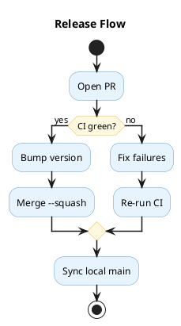

# Visual Styling Guidelines

## Arrow Thickness

**MANDATORY:** Never leave arrows at the default thickness. At the default `1` an arrow carries the same visual weight as element borders and lifelines, so the flow — the thing the diagram exists to show — is no longer what the eye finds first.

Set the thickness immediately after the opening tag, next to `title`:

| Diagram type | Skinparam |
|--------------|-----------|
| Sequence | `skinparam sequenceArrowThickness 1.5` |
| Activity, State, Class, Component, Object, Use Case, Deployment, ER | `skinparam ArrowThickness 1.5` |
| Timing, Network, MindMap, Gantt, WBS, JSON, YAML, Wireframe (Salt) | Not supported — omit |

`1.5` is the standard value; use it unless you have a specific reason not to. Do not go higher: at `2` a dashed implementation arrow (`<|..`) renders nearly solid, blurring the distinction from inheritance (`<|--`).

Sequence diagrams use their own skinparam — `ArrowThickness` has no effect there. They also need `skinparam LifeLineBorderColor #C0C0C0`, so that the lifelines recede and the messages stay the focal point.

### Example: non-sequence diagram

## Color Coding

Use color coding to improve diagram readability. Apply a **muted pastel palette** on white background (default). Do NOT set `skinparam backgroundColor` unless the user explicitly requests it.

**Recommended palette:**

| Color | Hex | Use for |
|-------|-----|---------|
| Soft blue | `#E8F4FD` / `#5B9BD5` | Primary elements, main flow |
| Soft green | `#E8F5E9` / `#70AD47` | Success paths, approved states |
| Soft red | `#FDE8E8` / `#E74C3C` | Error paths, rejected states |
| Soft yellow | `#FFF8E1` / `#F4B942` | Warnings, pending states |
| Soft purple | `#F3E8FD` / `#9B59B6` | External systems, third-party |
| Soft gray | `#F5F5F5` / `#95A5A6` | Inactive, deprecated |

**Color support by diagram type:**

| Support | Types |
|---------|-------|
| ✅ Full (skinparam, arrows, groups) | Sequence, Activity, State, Class, Component, Object, ER, Deployment |
| 🟡 Limited | Timing, Network, MindMap, Gantt, WBS |
| ❌ Not supported | JSON, YAML, Wireframe (Salt) |

**When to add a `legend`:**
- Colors encode specific meaning (error/success, internal/external, sync/async)
- Diagram has 5+ elements with distinct color-coded roles

**When NOT to color:**
- Diagram has only 2–3 simple elements (coloring adds noise)
- JSON, YAML, or Wireframe diagrams (no skinparam support)
