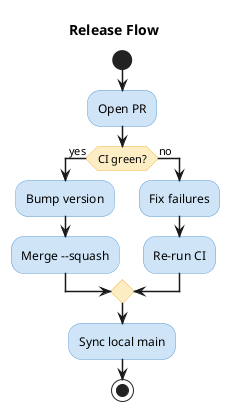
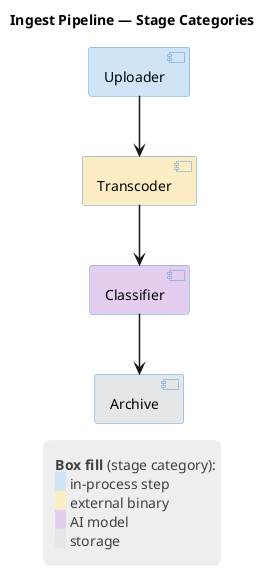

# Visual Styling Guidelines

## Arrow Thickness

**MANDATORY:** Never leave arrows at the default thickness. At the default `1` an arrow carries the same visual weight as element borders and lifelines, so the flow — the thing the diagram exists to show — is no longer what the eye finds first.

Set the thickness immediately after the opening tag, next to `title`:

| Diagram type | Skinparam |
|--------------|-----------|
| Sequence | `skinparam sequenceArrowThickness 1.5` |
| Activity, State, Class, Component, Object, Use Case, Deployment, ER | `skinparam ArrowThickness 1.5` |
| Timing, Network, MindMap, Gantt, WBS, JSON, YAML, Wireframe (Salt) | Not supported — omit |

`1.5` is the standard value; use it unless you have a specific reason not to. Do not go higher: at `2` a dashed implementation arrow (`<|..`) renders nearly solid, blurring the distinction from inheritance (`<|--`).

Sequence diagrams use their own skinparam — `ArrowThickness` has no effect there. They also need `skinparam LifeLineBorderColor #C0C0C0`, so that the lifelines recede and the messages stay the focal point.

### Example: non-sequence diagram




## Color Coding

Use color coding to improve diagram readability. Apply a **muted pastel palette** on white background (default). Do NOT set `skinparam backgroundColor` unless the user explicitly requests it.

**Recommended palette:**

| Color | Hex | Use for |
|-------|-----|---------|
| Soft blue | `#CFE4F6` / `#5B9BD5` | Primary elements, main flow |
| Soft green | `#D2E8CC` / `#70AD47` | Success paths, approved states |
| Soft red | `#F9CCC9` / `#E74C3C` | Error paths, rejected states |
| Soft yellow | `#FDEDC4` / `#F4B942` | Warnings, pending states |
| Soft purple | `#E3CEF0` / `#9B59B6` | External systems, third-party |
| Soft gray | `#E4E7E7` / `#95A5A6` | Inactive, deprecated |

Each fill is its border color blended 18% into white-ish pastel, so the two halves of a pair stay in the same hue family. The fills are deliberately darker than a plain pastel: against the `#EEEEEE` legend background (and on white), a fill any lighter stops reading as a distinct block and legend swatches lose their edge.

**Color support by diagram type:**

| Support | Types |
|---------|-------|
| ✅ Full (skinparam, arrows, groups) | Sequence, Activity, State, Class, Component, Object, ER, Deployment |
| 🟡 Limited | Timing, Network, MindMap, Gantt, WBS |
| ❌ Not supported | JSON, YAML, Wireframe (Salt) |

**When NOT to color:**
- Diagram has only 2–3 simple elements (coloring adds noise)
- JSON, YAML, or Wireframe diagrams (no skinparam support)

## Legend

**When to add a `legend`:**
- Colors encode specific meaning (error/success, internal/external, sync/async)
- Diagram has 5+ elements with distinct color-coded roles
- Arrow styles carry a convention the diagram does not spell out (see `references/sequence.md` for ACK suppression)

Every legend gets these three skinparams:

```
skinparam legendBackgroundColor #EEEEEE
skinparam legendBorderColor transparent
skinparam LegendFontColor #404040
```

**`LegendFontColor #404040`** — PlantUML renders legend text in pure black, which outweighs the diagram it annotates: element borders and arrow labels are drawn in subtler tones, so the legend — a footnote by intent — becomes the highest-contrast object on the canvas and pulls the eye away from the flow. Dark grey stays fully readable while giving the legend the visual weight of a caption. Set it as a skinparam rather than wrapping each line in `<color:#404040>`: one declaration covers the whole block, and a line added later cannot be forgotten. `#404040` is the standard value — lighter (`#808080` and up) is hard to read at small render sizes, darker defeats the point.

**`legendBorderColor transparent`** — drops the black 1px frame. The frame is the heaviest stroke on most diagrams, heavier than the element borders it sits next to. Note that `LegendBorderThickness 0` does *not* remove it; only a transparent border color does.

**`legendBackgroundColor #EEEEEE`** — keeps the panel readable as a distinct block once the frame is gone, but lighter than PlantUML's default `#DDD`. Do not push it to `#F5F5F5` or lighter: the palette's own soft-gray swatch would disappear into it.

Pair the text with `<back:#XXXXXX>   </back>` swatches (three spaces) when the legend maps colors to categories — the swatch shows the actual fill, so the reader matches it to the diagram without a color name in between.

**Padding.** PlantUML has no legend-specific padding skinparam. Indent the content lines by four spaces and bracket the block with `<size:6> </size>` lines — that buys a left inset and vertical breathing room without touching anything else. Do not reach for the global `skinparam Padding`: it inflates every element on the diagram, not just the legend. Do not use `&nbsp;` either — PlantUML renders it literally, as the text `&nbsp;`.




`legendBackgroundColor` and `legendBorderColor` are not in PlantUML's published skinparam list, but both work on the current server; `LegendFontColor` is documented. All three are skinparams, so they apply on every diagram type that supports `legend`, including those the color table above marks 🟡 Limited.
